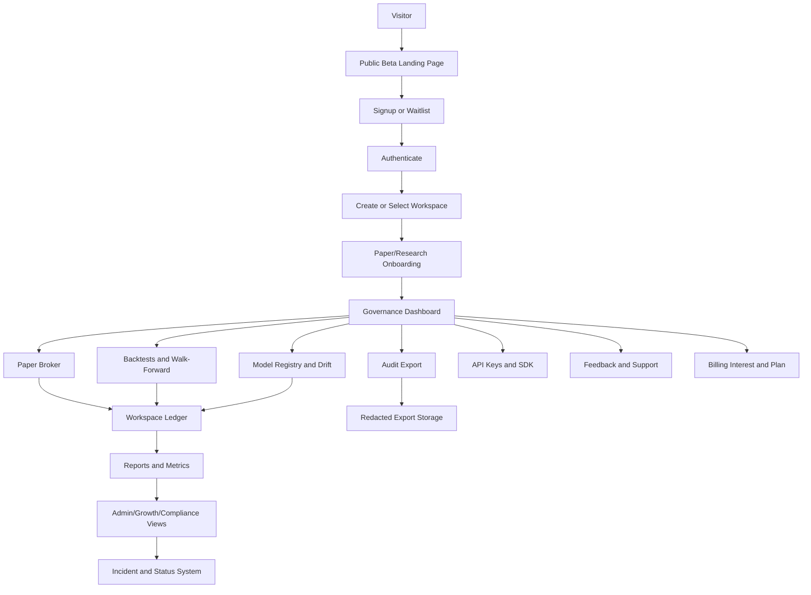
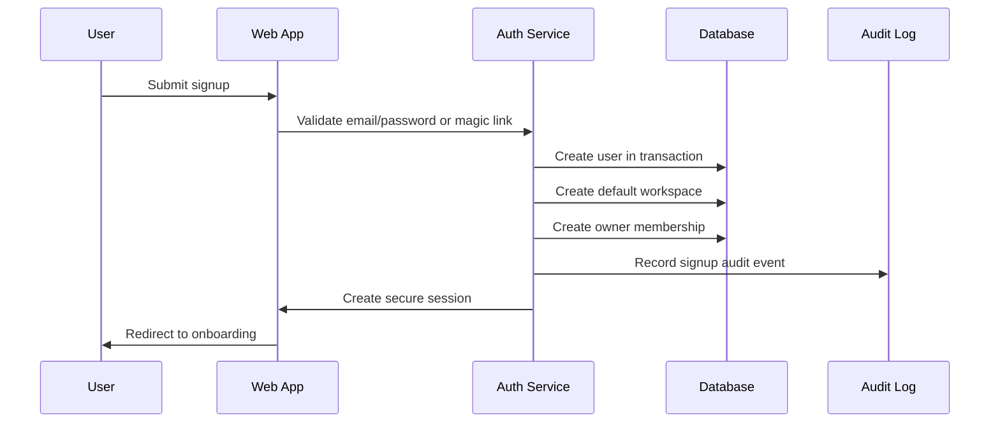
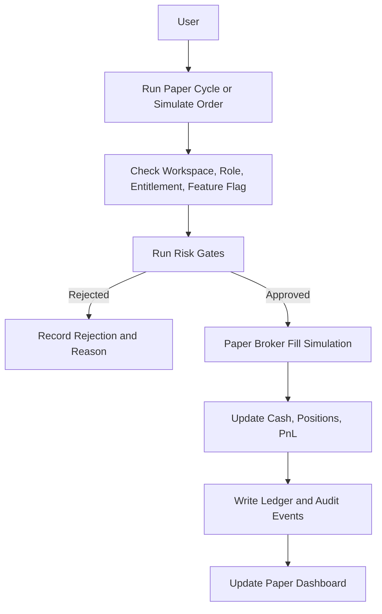
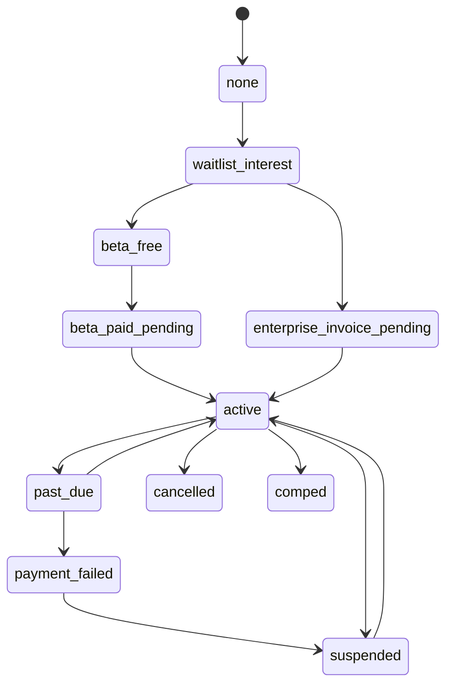
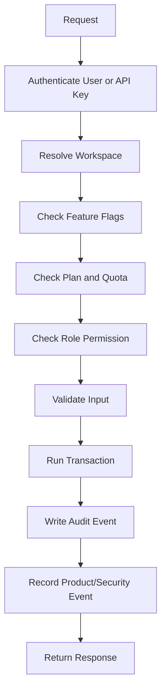
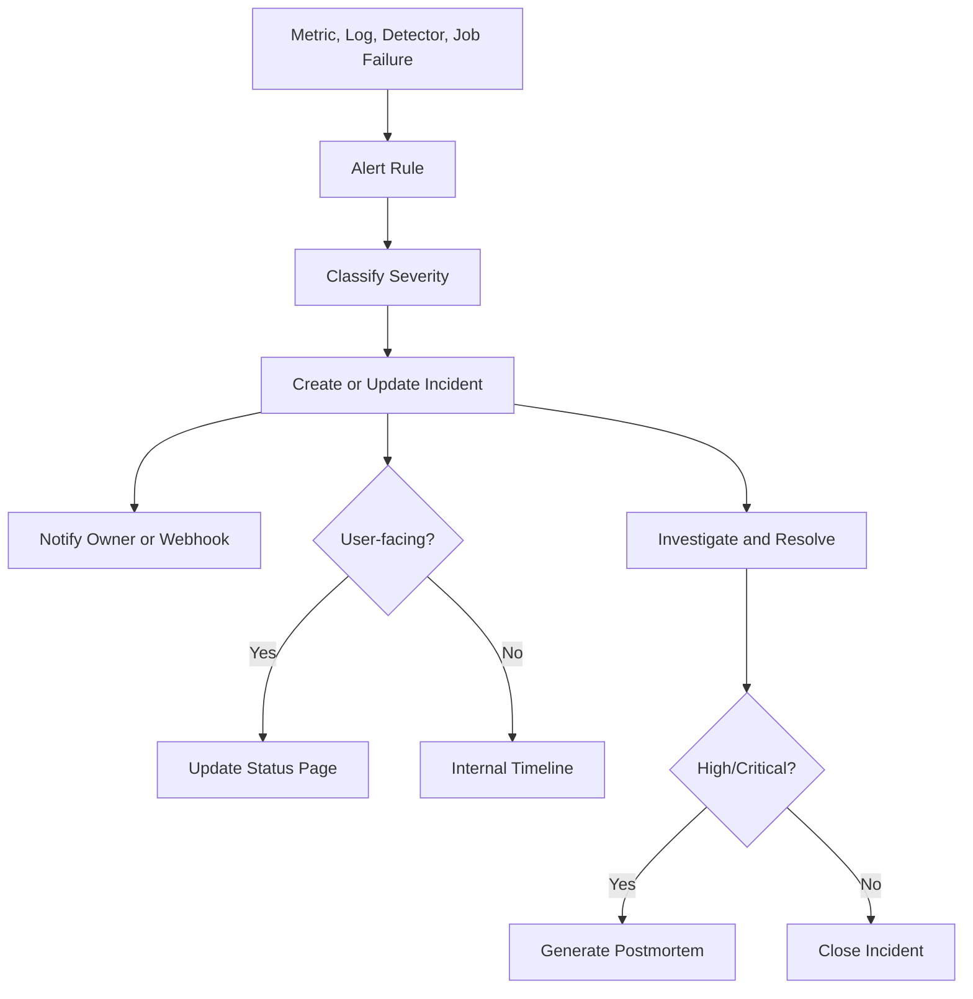

# Production App Flow

## Product

Taurus: Risk-First AI Trading Governance Platform

## Version

Draft v1.0

## Source Documents

- `PRD.md`
- `TRD.md`
- Roadmap and implementation schedule from `Pasted text.txt`
- Existing platform modules under `src/agent`, `src/etoro_api`, and `src/models`

## 1. Purpose

This document defines the production-ready app flow for evolving the current local autonomous trading agent into a hosted SaaS platform for paper trading, backtesting, model governance, audit exports, operational monitoring, API access, and commercial validation.

The flow is designed around one safety rule:

AI can research and score, but deterministic governance controls approve, reject, audit, and explain.

The app must remain legally safe:

- paper/research/governance-first,
- no personalised investment advice,
- no copy trading,
- no managed accounts,
- no public live execution for beta users,
- no return guarantees,
- no financial-promotion language.

## 2. Existing Platform Analysis

### 2.1 What Exists Now

The current repository is a local Python trading-agent scaffold with a strong governance core.

Existing technical capabilities:

- CLI runner through `run_agent.py` and `python3 -m agent`.
- Configuration through `config/strategy.toml` and `config/strategy.example.toml`.
- eToro API client under `src/etoro_api`.
- Market data provider and caching under `src/agent/data.py`.
- Trading decision cycle under `src/agent/engine.py`.
- Risk gates under `src/agent/risk.py` and order policy under `src/agent/order_policy.py`.
- Broker abstraction started in `src/agent/broker.py` with `ShadowBroker` and `EtoroBroker`.
- Guarded live execution requiring both `AUTOTRADER_ALLOW_LIVE=true` and `--allow-live`.
- Emergency kill switch through `state/KILL_SWITCH`.
- SQLite ledger through `src/agent/ledger.py`.
- JSONL audit log under `logs/audit.jsonl`.
- Monitoring alerts under `src/agent/monitoring.py`.
- Broker reconciliation under `src/agent/reconcile.py`.
- Backtesting and walk-forward validation under `src/agent/backtest.py`.
- Model calibration, training, reliability, and governance support under `src/agent/calibration.py`, `src/agent/training.py`, and `src/agent/reliability.py`.
- Tests for risk, data, chart, news, ML, reconciliation, reliability, order policy, and engine shadow behavior.

### 2.2 What Is Missing For Production SaaS

Missing product/platform capabilities:

- Web app and dashboard routes.
- Authentication, sessions, account recovery.
- Users, organisations, workspaces, workspace membership.
- Role-based access control.
- Tenant isolation across every user-owned record.
- Paper broker simulator as a first-class hosted mode.
- Hosted database strategy and migrations.
- API v1 and SDK.
- Billing waitlist, billing state machine, entitlements, and payment provider integration.
- Feature flags and A/B testing.
- Product analytics, conversion, retention, and churn instrumentation.
- Data export/deletion/privacy controls for GDPR/CCPA.
- Incident management, status page, escalation workflows.
- Cloud deployment, health/readiness checks, rollbacks, load balancing, backup/restore.
- Operational support dashboard.
- Security controls beyond local secret hygiene.
- Public documentation site and production runbooks.

### 2.3 Current Risk Profile

Strengths:

- The trading core is risk-first and auditable.
- Live trading is explicitly gated.
- The agent already records decisions, order attempts, cycle history, and reconciliation findings.
- The project already has meaningful unit tests around core engine behavior.

Production risks:

- Local SQLite and file-based logs are not enough for hosted multi-user operation.
- Private runtime files exist locally and must remain excluded from Git.
- There is no user identity layer, so no access-control boundary exists yet.
- Existing records are not workspace-scoped.
- There is no hosted incident, support, billing, privacy, or retention workflow.
- There is no production-grade observability or deployment pipeline yet.

## 3. High-Level Production App Flow

## 4. User App Flows

### 4.1 Public Visitor Flow

Purpose:

Convert a visitor into a legally safe beta signup or waitlist lead.

Flow:

1. Visitor opens public landing page.
2. App displays positioning: paper trading, research, model governance, audit tooling.
3. App displays safety notice: not investment advice, no live trading for beta users.
4. Visitor chooses one of:
   - join early access,
   - view docs,
   - read whitepaper,
   - view demo,
   - view pricing interest.
5. If visitor submits form, app collects minimal data:
   - name,
   - email,
   - role,
   - organisation optional,
   - intended use case,
   - country optional,
   - referral source,
   - consent to be contacted.
6. App rate-limits submission.
7. App stores lead or beta signup.
8. App records product event.
9. App shows confirmation and next step.

Production controls:

- No broker credentials collected.
- No investment preferences collected.
- No portfolio values collected.
- Non-essential cookies require consent.
- Form submissions are spam/rate-limit protected.

### 4.2 Signup And Authentication Flow

Requirements:

- Password auth must use Argon2id or bcrypt.
- Session cookie must be HTTP-only and signed.
- Hosted cookies must use `Secure=true`.
- Login failures must be recorded.
- Login and signup must be rate-limited.
- Disabled users cannot authenticate.
- Account disable must revoke sessions.

### 4.3 Workspace Onboarding Flow

Purpose:

Make the user productive without exposing live trading or regulated activity.

Flow:

1. User logs in.
2. App checks active workspace.
3. If no active workspace exists, app creates Personal Workspace.
4. App shows onboarding checklist:
   - confirm paper/research-only scope,
   - seed paper account,
   - load sample data,
   - run first backtest,
   - view risk dashboard,
   - create optional API key,
   - submit feedback.
5. App records activation events.
6. App updates onboarding state.

Acceptance criteria:

- Public beta users are defaulted to paper mode.
- Hosted demo rejects live mode regardless of config.
- User can complete onboarding without broker credentials.

### 4.4 Dashboard Flow

Main dashboard sections:

- overview,
- decisions,
- risk,
- paper portfolio,
- backtests,
- walk-forward,
- model registry,
- drift,
- reliability,
- reconciliation,
- audit events,
- API keys,
- exports,
- support/feedback,
- billing interest,
- workspace settings.

Flow:

1. User requests dashboard.
2. App authenticates session.
3. App resolves active workspace.
4. App loads user role and feature flags.
5. App queries only workspace-scoped summaries.
6. App renders dashboard with persistent safety notice.
7. App records dashboard view event.

Production controls:

- Viewer can read but cannot trigger jobs or exports.
- Admin/owner-only controls are hidden and server-protected.
- All list pages are paginated.
- Summary data is cached where safe.

## 5. Core Product Workflows

### 5.1 Paper Trading Flow

Requirements:

- No eToro API call is allowed in paper mode.
- Paper broker state is workspace-scoped.
- Cash cannot go negative unless margin is explicitly enabled later.
- Every simulated order has deterministic audit trail.
- Risk rejection reasons are visible.

### 5.2 Backtest And Walk-Forward Flow

Flow:

1. User opens validation page.
2. App checks role, entitlement, quota, and feature flag.
3. User starts backtest or walk-forward run.
4. App creates idempotent job record.
5. Worker loads cached/sample data.
6. Worker calls existing backtest/walk-forward services.
7. Results are persisted with workspace ID, config snapshot, assumptions, metrics, and timestamps.
8. User views list/detail page.
9. User exports Markdown/JSON report.

Production controls:

- Historical results disclaimer is displayed.
- Long-running work runs in background job.
- Job retries are idempotent.
- Large result artifacts are stored outside primary database.

### 5.3 Model Registry And Drift Flow

Flow:

1. User opens model registry.
2. App lists workspace-scoped model versions.
3. User triggers training if role, quota, data volume, and feature flag allow.
4. Worker trains candidate model.
5. Governance gates compare candidate against active model.
6. Candidate is promoted, rejected, or left pending.
7. Every action is written to model events and audit events.
8. Drift analyzer compares recent feature/prediction/outcome data against baseline.
9. Severe drift marks model as `review_required`.
10. Model registry and incidents update.

Production controls:

- No arbitrary model upload in MVP.
- Promotion cannot bypass governance gates.
- Rollback is owner/admin-only and audited.
- Severe drift never auto-promotes a replacement model.

### 5.4 Audit Export Flow

Flow:

1. Owner/admin selects workspace and date range.
2. App checks export entitlement and quota.
3. App creates idempotent export job.
4. Worker fetches workspace-scoped data:
   - decisions,
   - risk checks,
   - orders,
   - paper trades,
   - backtests,
   - walk-forward,
   - models,
   - drift,
   - incidents,
   - API usage,
   - admin actions.
5. Redaction service removes secrets and unnecessary personal data.
6. Worker writes JSON/CSV/Markdown/ZIP artifact.
7. Worker creates manifest with row counts and SHA-256 checksums.
8. App stores artifact in object storage.
9. User downloads export.

Acceptance criteria:

- Export cannot include another workspace's data.
- Export cannot include API keys, credentials, tokens, cookies, or raw secrets.
- Export has manifest and checksum.

## 6. Commercial And Billing Flows

### 6.1 Billing Interest Flow

Initial flow before paid launch:

1. User opens pricing/waitlist page.
2. App displays research/paper-governance product tiers.
3. User selects tier:
   - Builder,
   - Team,
   - Research Lab.
4. User enters role, company optional, use case, expected monthly budget range, and consent.
5. App stores billing interest.
6. Admin views/export billing interest.
7. Product event updates conversion funnel.

Controls:

- No card data collected.
- No paid live trading offered.
- No investment advice sold.

### 6.2 Subscription State Flow

Technical rules:

- Subscription transitions must be explicit.
- Entitlements are derived from subscription state, plan, role, quota, and feature flags.
- Billing webhooks must be verified and idempotent.
- Payment provider IDs are stored, but raw card data is never stored.
- Cancelled users keep data export and deletion rights.

### 6.3 Payment Webhook Flow

Flow:

1. Payment provider sends webhook.
2. App verifies signature.
3. App checks idempotency by provider event ID.
4. App loads subscription/customer mapping.
5. App applies allowed state transition.
6. App writes subscription event and audit event.
7. App updates entitlements.
8. App records metric.
9. Duplicate webhook returns previous result.

Failure handling:

- Invalid signature rejected.
- Unknown customer stored as billing incident.
- Duplicate event ignored safely.
- Repeated webhook failures create incident.

## 7. Access Control And CRUD Flows

### 7.1 Standard CRUD Request Flow

Required behavior:

- All write actions use service layer.
- Every workspace-owned operation receives explicit `workspace_id`.
- Archive/revoke/cancel/pseudonymise is preferred over hard delete.
- Sensitive admin actions require audit event.
- All list reads are paginated and filtered.

### 7.2 Tenant Isolation Flow

Flow:

1. User logs in or API key authenticates.
2. App resolves workspace context.
3. Service receives `workspace_id`.
4. Query builder/helper enforces `WHERE workspace_id = ?`.
5. Test suite verifies cross-tenant attempts fail.
6. Suspicious cross-tenant access attempt creates security event.
7. Repeated attempts create incident.

Launch blocker:

No public beta until workspace isolation tests pass across all tenant-owned tables.

## 8. Operational Flows

### 8.1 Logging Flow

Flow:

1. Request enters app.
2. App assigns `request_id`.
3. App executes route/service.
4. Logger receives structured event.
5. Redaction service removes secrets and sensitive fields.
6. Log is written to environment-specific sink.
7. Metrics are emitted.
8. Error events are evaluated for alerts/incidents.

Log categories:

- application,
- audit,
- security,
- billing,
- API,
- jobs,
- broker,
- model,
- incident.

### 8.2 Alert And Incident Flow

Incident sources:

- data ingestion failure,
- broker adapter failure,
- paper broker inconsistency,
- reconciliation drift,
- model drift,
- API error spike,
- login/rate-limit attack,
- failed audit export,
- failed billing webhook,
- backup failure,
- kill switch activation.

### 8.3 Disaster Recovery Flow

Flow:

1. Backup job runs on schedule.
2. Backup success/failure is logged.
3. Backup failure creates alert.
4. Monthly restore test restores latest backup to staging.
5. Restore result is documented.
6. If production outage occurs:
   - freeze writes if needed,
   - restore database,
   - restore object artifacts,
   - redeploy last known good app,
   - verify health and readiness,
   - update status page,
   - write incident postmortem.

Targets:

- Beta RPO: 24 hours.
- Beta RTO: 8 hours.
- Production RPO: 1 hour.
- Production RTO: 2 hours.

### 8.4 Rollback Flow

Flow:

1. Deployment fails smoke test or incident threshold.
2. Release owner triggers rollback.
3. App rolls back to previous immutable artifact.
4. Risky features are disabled via feature flags if needed.
5. Migration rollback or forward-fix is applied.
6. Health/readiness checks run.
7. Incident/status page is updated if user-facing.
8. Release notes are updated.

Controls:

- Public beta cannot launch without rollback runbook.
- Database migrations require rollback or forward-fix notes.
- Feature flags must be available for risky product surfaces.

## 9. Privacy, GDPR/CCPA, Cookies, And Adtech Flows

### 9.1 Consent Flow

Flow:

1. User sees privacy/cookie notice.
2. Essential cookies are always allowed.
3. Non-essential analytics/adtech cookies are disabled until consent.
4. User sets consent preferences.
5. App stores consent record.
6. App applies consent to analytics, marketing, testimonial, and anonymised evidence use.
7. User can update consent later.
8. Consent changes are audited.

### 9.2 Data Export Flow

Flow:

1. User requests personal data export.
2. App authenticates user.
3. App gathers personal records:
   - user profile,
   - workspace memberships,
   - consents,
   - feedback,
   - testimonials,
   - billing interest,
   - support tickets,
   - API key metadata,
   - product events where personal.
4. App redacts secrets.
5. App creates export file.
6. User downloads export.
7. App records audit event.

### 9.3 Deletion/Pseudonymisation Flow

Flow:

1. User requests deletion.
2. App checks whether records are deletable or must be retained for audit integrity.
3. App deletes non-audit personal records where allowed.
4. App pseudonymises audit-bound personal fields where full deletion conflicts with governance records.
5. App revokes sessions and API keys if account is deleted.
6. App records deletion request and outcome.

### 9.4 Adtech Rules

Rules:

- No adtech pixels in authenticated app by default.
- No personal financial data sent to analytics/adtech providers.
- No non-essential cookie until consent.
- Marketing consent is separate from product terms.
- Testimonial consent is separate from marketing consent.

## 10. Performance, Scalability, And Load Flow

### 10.1 Request Performance Flow

Flow:

1. Load balancer receives request.
2. Health/readiness checks route traffic only to healthy replicas.
3. Web worker handles request without local session dependency.
4. Cached summaries are used for dashboard pages.
5. Heavy jobs are submitted to worker queue.
6. Database queries use workspace/timestamp/status indexes.
7. Metrics record latency and error rate.

Targets:

- `/healthz` p95 under 100 ms.
- Cached dashboard p95 under 500 ms.
- API list p95 under 800 ms.
- Job creation p95 under 1 second.

### 10.2 Background Job Flow

Jobs:

- backtests,
- walk-forward validations,
- model training,
- drift reports,
- audit exports,
- compliance packs,
- billing webhook processing if async,
- email/support notifications,
- retention jobs,
- report generation.

Flow:

1. Request creates job record with workspace and idempotency key.
2. Worker picks job.
3. Worker checks feature flag, entitlement, quota, and workspace.
4. Worker executes service.
5. Worker writes result.
6. Worker records metrics and audit event.
7. Worker retries according to policy.
8. Repeated failure creates incident.

## 11. CI/CD And Environment Flow

### 11.1 CI Flow

Flow:

1. Code pushed.
2. CI installs package.
3. CI runs unit tests.
4. CI runs integration tests.
5. CI runs tenant isolation tests.
6. CI runs secret tracking checks.
7. CI runs dependency/security scan where practical.
8. CI builds docs site if present.
9. CI runs SDK smoke tests if SDK exists.
10. CI blocks merge/deploy on failure.

### 11.2 Deployment Flow

Flow:

1. Build immutable app image/artifact.
2. Deploy to staging.
3. Run migrations.
4. Run smoke tests.
5. Verify `/healthz` and `/readyz`.
6. Manually approve production.
7. Deploy production.
8. Run production smoke tests.
9. Record release metadata.
10. Monitor alerts.

Environments:

- local,
- test,
- CI,
- staging,
- production beta,
- production commercial.

## 12. Product Analytics Flow

### 12.1 Instrumentation Flow

Events:

- signup started,
- signup completed,
- login,
- workspace created,
- paper account seeded,
- first paper order,
- first backtest,
- first audit export,
- API key created,
- model registry viewed,
- billing interest submitted,
- feedback submitted,
- subscription changed,
- churn signal detected.

Flow:

1. User action occurs.
2. App checks consent and event sensitivity.
3. App records event with user/workspace/anonymous ID where allowed.
4. Funnel metrics update.
5. Admin dashboard aggregates metrics.
6. Growth/evidence export redacts personal data.

### 12.2 Conversion Flow

Main funnel:

1. Landing/docs/demo view.
2. Signup or waitlist.
3. Login.
4. Workspace created.
5. Paper account seeded.
6. Backtest or paper order completed.
7. Audit export/API/model feature used.
8. Billing interest submitted.
9. LOI, pilot, or paid beta.

### 12.3 Retention And Churn Control Flow

Churn signals:

- no login after signup,
- no activation within 7 days,
- no activity in 14 or 30 days,
- repeated failed jobs,
- cancelled subscription,
- past due subscription,
- negative feedback.

Controls:

- onboarding checklist,
- sample data,
- docs prompts,
- support follow-up,
- bug/feedback resolution,
- safe educational emails with consent,
- admin retention dashboard.

## 13. Support And Escalation Flow

Flow:

1. User submits feedback or bug report.
2. App creates support ticket.
3. Ticket is categorized:
   - product bug,
   - security,
   - privacy/data,
   - billing,
   - compliance,
   - docs,
   - feature request,
   - incident follow-up.
4. App assigns severity.
5. Support operator/owner reviews.
6. If operational, ticket links to incident.
7. User receives response according to SLA.
8. Monthly support themes are exported.

Escalations:

- Security or data leak: critical incident.
- Tenant isolation concern: critical incident and disable affected feature.
- Live execution exposure: kill switch and disable execution features.
- Billing issue: high severity if payment/entitlement affected.
- Compliance concern: pause feature/copy and mark legal review required.

## 14. Governance Flow

Governance checkpoints:

- feature design,
- legal-safe copy review,
- security review,
- privacy review,
- tenant isolation test,
- billing review,
- release approval,
- incident postmortem,
- model promotion review,
- audit export review.

Flow:

1. Feature proposal is created.
2. Product scope matrix classifies risk.
3. Feature is tagged:
   - safe,
   - beta-only,
   - admin-only,
   - requires legal review,
   - blocked.
4. Engineering implements behind feature flag.
5. Tests and docs are added.
6. Release checklist verifies safety.
7. Feature is enabled gradually.
8. Metrics, feedback, incidents, and churn are monitored.

Features requiring legal review:

- live execution for users,
- broker credential storage,
- personalised recommendations,
- copy trading,
- managed accounts,
- paid trading signals,
- crypto promotion,
- return claims,
- financial promotions.

## 15. Vendor Lock-In And Platform Portability Flow

Provider abstractions:

- broker,
- billing,
- email,
- storage,
- queue,
- analytics,
- secrets,
- database.

Portability rules:

- Exports use JSON, CSV, Markdown, ZIP.
- API is documented through OpenAPI.
- SDK is built around stable API contracts.
- Object storage should be S3-compatible where practical.
- Hosted database should use Postgres-compatible SQL.
- Billing state must not depend only on provider-specific terms.
- Broker logic must use adapter capability discovery.

Exit flows:

- export all workspace data,
- migrate SQLite to Postgres,
- migrate object storage,
- rotate secrets,
- switch billing provider,
- switch hosting provider,
- disable vendor-specific integrations behind feature flags.

## 16. Cloud Cost Flow

Flow:

1. App records usage:
   - API requests,
   - jobs,
   - storage,
   - logs,
   - exports,
   - database size.
2. Cost dashboard aggregates by environment and workspace.
3. Quotas limit expensive work:
   - backtests,
   - walk-forward,
   - model training,
   - audit exports,
   - API requests.
4. Budget alerts trigger when thresholds are crossed.
5. Admin reviews cost per active workspace and per export/job.

Controls:

- staging auto-sleep where possible,
- log retention limits,
- object storage lifecycle policy,
- plan-based quotas,
- cloud budget alerts.

## 17. Multi-Region Flow

Initial:

- Single-region deployment with managed backups.

Future:

1. Add read replicas for reporting/API reads.
2. Replicate object storage.
3. Create active-passive failover runbook.
4. Review data residency before replicating personal data.
5. Test regional failover.
6. Update disaster recovery targets.

Acceptance criteria before enterprise:

- multi-region plan documented,
- backup/restore tested,
- data residency reviewed,
- failover drill recorded.

## 18. Timeline-Based App Flow Evolution

### June 2026: Foundation

Flow focus:

- local CLI product,
- repo hygiene,
- safe docs,
- architecture and governance writing,
- demo-only operating protocol.

Output:

- public-safe repository and docs foundation.

### July 2026: Read-Only Product Surface

Flow focus:

- local web dashboard reads ledger/reporting data,
- Docker and CI,
- legal-safe dashboard notices,
- demo video flow.

Output:

- reviewers and early advisers can see product behavior without private broker data.

### August 2026: SaaS Foundation

Flow focus:

- signup,
- login,
- workspace creation,
- protected dashboard,
- hosted staging,
- paper broker,
- early access collection.

Output:

- product becomes multi-user and safe for paper beta.

### September 2026: Private Beta

Flow focus:

- invite-only registration,
- onboarding,
- backtest UI,
- walk-forward UI,
- model registry,
- feedback,
- beta admin dashboard.

Output:

- 10 to 20 users can test paper/research workflows.

### October 2026: Developer Platform

Flow focus:

- API keys,
- API v1,
- SDK,
- broker adapters,
- audit exports,
- case study.

Output:

- platform becomes useful to fintech/AI developers.

### November 2026: Commercial And Security Hardening

Flow focus:

- billing interest,
- subscription state design,
- tenant isolation hardening,
- security controls,
- compliance review,
- growth tracking.

Output:

- commercial validation without unsafe charging or regulated scope creep.

### December 2026: Public Beta

Flow focus:

- public signup/waitlist,
- paper-only onboarding,
- feedback,
- status/incidents,
- testimonials,
- whitepaper.

Output:

- public product with operational and legal-safe controls.

### January 2027: Enterprise Readiness

Flow focus:

- model drift,
- incident management,
- status page,
- enterprise admin,
- commercial traction tracking.

Output:

- B2B beta/product maturity.

### February-May 2027: Evidence And Stability

Flow focus:

- reports,
- adoption metrics,
- media/recommender packs,
- GDPR/security hardening,
- compliance pack,
- product freeze,
- final demo,
- metrics dossier.

Output:

- stable product snapshot and verified evidence.

## 19. Production Readiness Checklist

Private beta:

- authentication implemented,
- workspace isolation implemented,
- paper broker implemented,
- live trading blocked,
- feedback flow implemented,
- usage events implemented,
- CI passing,
- safety copy present.

Public beta:

- privacy notice,
- cookie controls,
- rate limits,
- feature flags,
- incident system,
- status page,
- audit export redaction,
- backup/restore runbook,
- rollback runbook,
- support workflow.

Paid beta:

- legal/accounting review complete,
- billing state machine implemented,
- webhook idempotency implemented,
- entitlement checks implemented,
- cancellation/refund flow documented,
- support escalation ready.

Enterprise pilot:

- tenant isolation proof,
- enterprise admin,
- audit/compliance pack,
- GDPR/CCPA flows,
- data retention settings,
- incident postmortem process,
- backup restore test,
- commercial tracking.

## 20. Immediate Platform Development Sequence

Recommended build order:

1. Keep Git/repo hygiene safe and exclude private runtime files.
2. Add read-only dashboard over existing ledger/reporting.
3. Add Docker, CI, health checks, and route tests.
4. Add auth, sessions, workspaces, and RBAC.
5. Add workspace-scoped schema migration and isolation helpers.
6. Add paper broker and hosted paper-only onboarding.
7. Add feature flags, product events, and rate limits.
8. Add backtest/walk-forward UI and model registry.
9. Add API keys, API v1, and SDK.
10. Add audit exports with redaction and checksums.
11. Add billing interest and subscription state machine.
12. Add security hardening, incidents, status page, and support ops.
13. Add GDPR/CCPA controls and retention jobs.
14. Add growth, conversion, retention, churn, and cloud cost dashboards.
15. Freeze public beta and evidence demo only after launch gates pass.

