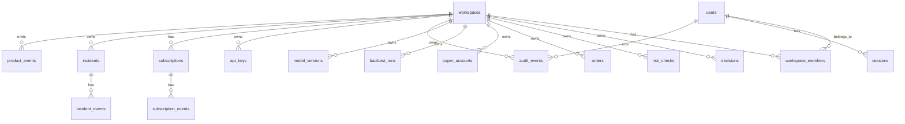

# Backend Schema

## Product

Taurus: Risk-First AI Trading Governance Platform

## Version

Draft v1.0

## Source Documents

- `PRD.md`
- `TRD.md`
- `APP_FLOW.md`
- `DESIGN_UI_UX_BRIEF.md`
- Roadmap and implementation schedule from `Pasted text.txt`
- Existing SQLite ledger in `src/agent/ledger.py`

## 1. Purpose

This document defines the production backend schema for turning the current local trading-governance agent into a scalable SaaS platform.

The schema must support:

- authentication,
- payments and billing,
- subscription states,
- CRUD workflows,
- role-based access controls,
- tenant isolation,
- data integrity,
- scalable reads/writes,
- latency optimization,
- load balancing,
- logging and alerting,
- incident response,
- disaster recovery,
- data retention,
- GDPR/CCPA workflows,
- rate limiting,
- CI/CD and environments,
- rollbacks,
- feature flags,
- test coverage,
- instrumentation,
- conversion, retention, and churn control,
- cloud cost controls,
- multi-region readiness,
- idempotency,
- support operations,
- escalations,
- governance,
- platform support,
- adtech/cookies/consent,
- secrets management,
- documentation,
- A/B testing,
- vendor lock-in mitigation,
- platform development.

## 2. Existing Platform Analysis

### 2.1 Existing Data Model

The current platform already has a rich local SQLite ledger. Existing tables include:

- `decisions`
- `risk_checks`
- `orders`
- `loss_events`
- `trade_outcomes`
- `broker_account_snapshots`
- `reconciliations`
- `model_calibrations`
- `cycle_health`
- `position_reviews`
- `open_trade_contexts`
- `feature_snapshots`
- `feature_values`
- `cycle_feature_store`
- `cycle_market_snapshots`
- `cycle_candle_history`
- `cycle_news_items`
- `cycle_portfolio_snapshots`
- `cycle_portfolio_positions`
- `cycle_regime_history`
- `training_examples`
- `model_training_runs`
- `model_registry`
- `model_promotion_events`
- `reliability_reports`
- `trade_root_causes`
- `decision_veto_memory`
- `portfolio_risk_reports`
- `committee_votes`
- `execution_simulations`
- `news_source_stats`
- `news_source_outcomes`
- `news_source_credibility`

### 2.2 Existing Strengths

- The ledger is already audit-oriented.
- Trading decisions, risk checks, orders, model governance, feature snapshots, reliability, reconciliation, and execution quality are persisted.
- SQLite WAL mode and foreign keys are already used locally.
- Existing schema is suitable for single-user research and demo validation.
- The current engine records detailed raw JSON that can support future dashboard views and audit exports.

### 2.3 Production Gaps

Current tables are not yet production SaaS-ready because:

- Most records lack `workspace_id`.
- Most records lack `actor_user_id`.
- There is no identity schema.
- There is no organization/workspace membership schema.
- There is no subscription/billing schema.
- There is no idempotency schema.
- There is no feature flag schema.
- There is no product analytics schema.
- There is no incident/status/support schema.
- There is no GDPR/CCPA data request schema.
- There is no retention policy schema.
- There is no API key schema.
- There is no production migration/versioning table.
- JSON-heavy fields are useful for flexibility but need selected indexed columns for fast dashboard/API queries.

### 2.4 Migration Strategy

Production migration should preserve existing local data.

Required migration approach:

1. Create a default user and default workspace for existing local records.
2. Add `workspace_id` to tenant-owned trading tables.
3. Backfill all existing rows into the default workspace.
4. Add indexes on `workspace_id`, `created_at`, status fields, and common filter fields.
5. Preserve raw JSON columns.
6. Add normalized columns only where needed for dashboard performance, reporting, search, or compliance.
7. Keep SQLite local mode compatible.
8. Use Postgres for hosted staging/public beta.

## 3. Database Architecture

### 3.1 Database Engines

Local development:

- SQLite.
- WAL mode.
- Foreign keys enabled.
- File path from config/env.

Hosted staging and production:

- Postgres.
- Managed backups.
- Connection pooling.
- Read replicas later for analytics/reporting.

Object storage:

- S3-compatible storage for large audit exports, model artifacts, report artifacts, compliance packs, and screenshots.

Cache/rate-limit store:

- Redis-compatible backend for hosted environments.

### 3.2 Schema Naming

Recommended logical schemas in Postgres:

- `identity`
- `platform`
- `trading`
- `governance`
- `billing`
- `analytics`
- `compliance`
- `support`
- `ops`

SQLite local mode may use flat table names with prefixes.

### 3.3 Shared Column Standards

All durable tables should use:

- `id`: UUID in hosted production, integer accepted in legacy SQLite.
- `created_at`: timestamptz.
- `updated_at`: timestamptz for mutable tables.
- `workspace_id`: UUID for tenant-owned tables.
- `created_by_user_id`: UUID where user-created.
- `actor_user_id`: UUID for audited actions.
- `deleted_at`: timestamptz for soft deletion where applicable.
- `metadata_json`: JSONB/Postgres or TEXT/SQLite.

Use UTC timestamps everywhere.

### 3.4 Data Types

Postgres target:

- UUID primary keys.
- `timestamptz` for time.
- `jsonb` for raw payloads and flexible metadata.
- `numeric(18, 6)` for money/price fields where precision matters.
- `double precision` for model/statistical metrics where appropriate.
- `text` for external IDs.
- `boolean` for true/false states.

SQLite compatibility:

- Store UUIDs as TEXT.
- Store JSONB as TEXT JSON.
- Store timestamptz as ISO 8601 TEXT.
- Store booleans as INTEGER 0/1.

## 4. High-Level Entity Map

## 5. Identity And Authentication Schema

### 5.1 `users`

Purpose:

Stores user identity and account lifecycle.

Columns:

| Column | Type | Required | Notes |
| --- | --- | --- | --- |
| id | uuid | yes | primary key |
| email | citext/text | yes | unique normalized email |
| display_name | text | no | profile display |
| status | text | yes | active, disabled, pending_verification, deleted |
| email_verified_at | timestamptz | no | verification timestamp |
| last_login_at | timestamptz | no | recent login |
| timezone | text | no | user preference |
| locale | text | no | user preference |
| created_at | timestamptz | yes | UTC |
| updated_at | timestamptz | yes | UTC |
| deleted_at | timestamptz | no | soft deletion |
| metadata_json | jsonb | yes | default `{}` |

Indexes:

- unique `lower(email)` where `deleted_at is null`.
- `status`.
- `created_at`.

### 5.2 `password_credentials`

Purpose:

Stores password authentication data if password auth is used.

Columns:

| Column | Type | Required | Notes |
| --- | --- | --- | --- |
| id | uuid | yes | primary key |
| user_id | uuid | yes | FK users |
| password_hash | text | yes | Argon2id or bcrypt |
| hash_algorithm | text | yes | argon2id, bcrypt |
| password_changed_at | timestamptz | yes | rotation tracking |
| created_at | timestamptz | yes | UTC |
| updated_at | timestamptz | yes | UTC |

Constraints:

- unique `user_id`.

Security:

- Never return this table through API.
- Never include in audit exports.

### 5.3 `sessions`

Purpose:

Tracks authenticated web sessions and revocation.

Columns:

| Column | Type | Required | Notes |
| --- | --- | --- | --- |
| id | uuid | yes | primary key |
| user_id | uuid | yes | FK users |
| session_hash | text | yes | hash of session token |
| status | text | yes | active, revoked, expired |
| ip_hash | text | no | hashed IP for security |
| user_agent_hash | text | no | hashed UA |
| created_at | timestamptz | yes | UTC |
| last_seen_at | timestamptz | no | activity |
| expires_at | timestamptz | yes | TTL |
| revoked_at | timestamptz | no | revoke time |
| revoke_reason | text | no | disabled, logout, security |

Indexes:

- `user_id, status`.
- `expires_at`.
- unique `session_hash`.

### 5.4 `magic_links`

Purpose:

Optional passwordless login and email verification.

Columns:

| Column | Type | Required | Notes |
| --- | --- | --- | --- |
| id | uuid | yes | primary key |
| email | text | yes | normalized |
| token_hash | text | yes | never store plaintext |
| purpose | text | yes | login, verify_email, reset_password |
| consumed_at | timestamptz | no | one-time use |
| expires_at | timestamptz | yes | TTL |
| created_at | timestamptz | yes | UTC |
| ip_hash | text | no | abuse prevention |

Indexes:

- unique `token_hash`.
- `email, purpose, created_at`.
- `expires_at`.

## 6. Tenancy And Access Control Schema

### 6.1 `workspaces`

Purpose:

Tenant boundary for all user-owned product data.

Columns:

| Column | Type | Required | Notes |
| --- | --- | --- | --- |
| id | uuid | yes | primary key |
| name | text | yes | workspace display name |
| slug | text | no | unique URL-safe name |
| type | text | yes | personal, team, enterprise, demo |
| status | text | yes | active, suspended, archived, deleted |
| default_execution_mode | text | yes | paper/shadow; never live for beta |
| region | text | no | data residency future |
| created_by_user_id | uuid | yes | FK users |
| created_at | timestamptz | yes | UTC |
| updated_at | timestamptz | yes | UTC |
| deleted_at | timestamptz | no | soft delete |
| metadata_json | jsonb | yes | default `{}` |

Indexes:

- unique `slug` where not null and not deleted.
- `status`.
- `created_at`.

### 6.2 `workspace_members`

Purpose:

Maps users to workspaces and roles.

Columns:

| Column | Type | Required | Notes |
| --- | --- | --- | --- |
| id | uuid | yes | primary key |
| workspace_id | uuid | yes | FK workspaces |
| user_id | uuid | yes | FK users |
| role | text | yes | owner, admin, viewer, support_operator |
| status | text | yes | active, invited, disabled, removed |
| invited_by_user_id | uuid | no | FK users |
| joined_at | timestamptz | no | accepted timestamp |
| created_at | timestamptz | yes | UTC |
| updated_at | timestamptz | yes | UTC |

Constraints:

- unique `workspace_id, user_id` where status is not removed.
- at least one active owner enforced by service logic.

Indexes:

- `user_id, status`.
- `workspace_id, role`.

### 6.3 `workspace_invites`

Purpose:

Private beta invite and team invite flow.

Columns:

| Column | Type | Required | Notes |
| --- | --- | --- | --- |
| id | uuid | yes | primary key |
| workspace_id | uuid | no | null for platform beta invite |
| email | text | yes | invited email |
| role | text | yes | owner/admin/viewer |
| invite_code_hash | text | yes | store hash only |
| status | text | yes | pending, accepted, expired, revoked |
| invited_by_user_id | uuid | yes | FK users/admin |
| accepted_by_user_id | uuid | no | FK users |
| accepted_at | timestamptz | no | accepted time |
| expires_at | timestamptz | yes | TTL |
| created_at | timestamptz | yes | UTC |

Indexes:

- unique `invite_code_hash`.
- `email, status`.
- `workspace_id, status`.

### 6.4 `permissions_audit`

Purpose:

Records explicit permission decisions for sensitive operations where auditability is needed.

Columns:

| Column | Type | Required | Notes |
| --- | --- | --- | --- |
| id | uuid | yes | primary key |
| workspace_id | uuid | no | nullable for platform-level |
| actor_user_id | uuid | no | FK users |
| actor_type | text | yes | user, api_key, system, support |
| permission | text | yes | permission checked |
| resource_type | text | yes | orders, exports, billing, etc |
| resource_id | text | no | target |
| allowed | boolean | yes | decision |
| reason | text | yes | allow/deny reason |
| created_at | timestamptz | yes | UTC |

Retention:

- 12 months minimum for beta.
- Longer for admin/security-sensitive actions.

## 7. API And Developer Access Schema

### 7.1 `api_keys`

Purpose:

Workspace-scoped developer API authentication.

Columns:

| Column | Type | Required | Notes |
| --- | --- | --- | --- |
| id | uuid | yes | primary key |
| workspace_id | uuid | yes | FK workspaces |
| name | text | yes | user label |
| key_prefix | text | yes | visible prefix |
| key_last4 | text | yes | visible last four |
| key_hash | text | yes | hash only |
| status | text | yes | active, revoked, expired |
| scopes_json | jsonb | yes | endpoint scopes |
| created_by_user_id | uuid | yes | FK users |
| last_used_at | timestamptz | no | usage |
| expires_at | timestamptz | no | optional |
| revoked_at | timestamptz | no | revoke time |
| revoked_by_user_id | uuid | no | FK users |
| created_at | timestamptz | yes | UTC |

Indexes:

- unique `key_hash`.
- `workspace_id, status`.
- `key_prefix`.

Security:

- plaintext key shown once only.
- revoke action audited.

### 7.2 `api_usage_events`

Purpose:

Tracks API usage, rate limits, SDK adoption, and support investigation.

Columns:

| Column | Type | Required | Notes |
| --- | --- | --- | --- |
| id | uuid | yes | primary key |
| workspace_id | uuid | yes | FK workspaces |
| api_key_id | uuid | no | FK api_keys |
| endpoint | text | yes | normalized route |
| method | text | yes | GET/POST/etc |
| status_code | integer | yes | response |
| latency_ms | integer | yes | server latency |
| rate_limited | boolean | yes | default false |
| request_id | text | yes | correlation |
| user_agent | text | no | SDK/client info |
| created_at | timestamptz | yes | UTC |
| metadata_json | jsonb | yes | redacted |

Indexes:

- `workspace_id, created_at`.
- `api_key_id, created_at`.
- `endpoint, created_at`.
- `status_code, created_at`.

Retention:

- Raw: 90 days.
- Aggregated: 12 months.

## 8. Trading Governance Schema

The existing ledger tables should be migrated, not discarded. Production versions must add tenant columns, selected indexes, and audit fields.

### 8.1 Shared Trading Columns

All tenant-owned trading tables must include:

- `workspace_id`
- `created_at`
- `cycle_id` where linked to an agent cycle
- `environment`: local, staging, production_beta, production_commercial
- `execution_mode`: shadow, paper, demo, live where relevant
- `source`: cli, web, api, worker, system
- `raw_json`

### 8.2 `agent_cycles`

Purpose:

Top-level record for each decision cycle.

Columns:

| Column | Type | Required | Notes |
| --- | --- | --- | --- |
| id | uuid | yes | primary key |
| workspace_id | uuid | yes | FK workspaces |
| cycle_id | text | yes | human/correlation ID |
| status | text | yes | completed, halted, failed |
| halt_reason | text | no | reason |
| execution_mode | text | yes | shadow/paper/demo/live |
| decision_count | integer | yes | count |
| risk_check_count | integer | yes | count |
| order_count | integer | yes | count |
| rejected_order_count | integer | yes | count |
| started_at | timestamptz | yes | UTC |
| completed_at | timestamptz | no | UTC |
| created_at | timestamptz | yes | UTC |
| raw_json | jsonb | yes | cycle payload |

Indexes:

- unique `workspace_id, cycle_id`.
- `workspace_id, created_at`.
- `workspace_id, status, created_at`.

Migration:

- Existing `cycle_health` becomes `agent_cycles` or maps into it.

### 8.3 `decisions`

Production extension of existing `decisions`.

Columns:

| Column | Type | Required | Notes |
| --- | --- | --- | --- |
| id | uuid | yes | primary key |
| workspace_id | uuid | yes | FK workspaces |
| cycle_id | text | no | FK-like to agent_cycles.cycle_id |
| symbol | text | yes | ticker/symbol |
| action | text | yes | BUY/SELL/HOLD/SKIP |
| confidence | double | yes | model/score confidence |
| score | double | yes | decision score |
| model_version | text | no | model version |
| risk_approved | boolean | no | denormalized for fast table |
| final_status | text | yes | proposed, approved, rejected, skipped |
| reasons_json | jsonb | yes | reason list |
| features_json | jsonb | yes | feature map |
| created_at | timestamptz | yes | UTC |

Indexes:

- `workspace_id, created_at desc`.
- `workspace_id, symbol, created_at desc`.
- `workspace_id, final_status, created_at desc`.
- `workspace_id, action, created_at desc`.

### 8.4 `risk_checks`

Production extension of existing `risk_checks`.

Columns:

| Column | Type | Required | Notes |
| --- | --- | --- | --- |
| id | uuid | yes | primary key |
| workspace_id | uuid | yes | FK workspaces |
| cycle_id | text | no | cycle |
| decision_id | uuid | no | FK decisions |
| symbol | text | yes | ticker |
| approved | boolean | yes | pass/fail |
| reason | text | yes | readable reason |
| severity | text | yes | info/low/medium/high/critical |
| target_notional_usd | numeric | yes | target |
| stop_loss_rate | numeric | no | risk output |
| take_profit_rate | numeric | no | risk output |
| raw_json | jsonb | yes | full gate details |
| created_at | timestamptz | yes | UTC |

Indexes:

- `workspace_id, created_at desc`.
- `workspace_id, approved, created_at desc`.
- `workspace_id, symbol, created_at desc`.
- `workspace_id, severity, created_at desc`.

### 8.5 `orders`

Production extension of existing `orders`.

Columns:

| Column | Type | Required | Notes |
| --- | --- | --- | --- |
| id | uuid | yes | primary key |
| workspace_id | uuid | yes | FK workspaces |
| cycle_id | text | no | cycle |
| decision_id | uuid | no | FK decisions |
| risk_check_id | uuid | no | FK risk_checks |
| symbol | text | yes | ticker |
| action | text | yes | BUY/SELL/CLOSE |
| accepted | boolean | yes | order accepted by adapter |
| mode | text | yes | shadow/paper/demo/live |
| broker_adapter | text | yes | shadow/paper/etoro |
| broker_order_id | text | no | external/simulated |
| idempotency_key | text | no | request key |
| message | text | yes | result message |
| raw_json | jsonb | yes | result payload |
| created_at | timestamptz | yes | UTC |

Indexes:

- `workspace_id, created_at desc`.
- `workspace_id, symbol, created_at desc`.
- `workspace_id, mode, created_at desc`.
- unique `workspace_id, idempotency_key` where not null.
- `broker_order_id` where not null.

Live-safety:

- Hosted public beta must reject `mode=live` before insert.

### 8.6 `execution_simulations`

Production extension of existing table.

Add:

- `workspace_id`
- `cycle_id`
- `decision_id`
- `order_id`
- `broker_adapter`
- `created_at`

Indexes:

- `workspace_id, created_at desc`.
- `workspace_id, symbol, created_at desc`.
- `workspace_id, simulation_id`.

### 8.7 `reconciliation_runs`

Maps from existing `reconciliations`.

Columns:

| Column | Type | Required | Notes |
| --- | --- | --- | --- |
| id | uuid | yes | primary key |
| workspace_id | uuid | yes | FK workspaces |
| status | text | yes | ok, warning, failed |
| message | text | yes | summary |
| alert_count | integer | yes | count |
| started_at | timestamptz | yes | UTC |
| completed_at | timestamptz | no | UTC |
| created_at | timestamptz | yes | UTC |
| raw_json | jsonb | yes | full report |

### 8.8 `reconciliation_alerts`

Columns:

| Column | Type | Required | Notes |
| --- | --- | --- | --- |
| id | uuid | yes | primary key |
| workspace_id | uuid | yes | FK workspaces |
| reconciliation_run_id | uuid | yes | FK reconciliation_runs |
| category | text | yes | position_drift, missing_order, stale_protection |
| severity | text | yes | low/medium/high/critical |
| symbol | text | no | ticker |
| message | text | yes | readable |
| status | text | yes | open, acknowledged, resolved |
| created_at | timestamptz | yes | UTC |
| resolved_at | timestamptz | no | UTC |
| raw_json | jsonb | yes | details |

Indexes:

- `workspace_id, status, created_at desc`.
- `workspace_id, severity, created_at desc`.

## 9. Paper Broker Schema

### 9.1 `paper_accounts`

Purpose:

Workspace-specific simulated account.

Columns:

| Column | Type | Required | Notes |
| --- | --- | --- | --- |
| id | uuid | yes | primary key |
| workspace_id | uuid | yes | FK workspaces |
| name | text | yes | account label |
| base_currency | text | yes | USD initially |
| starting_cash | numeric | yes | initial seed |
| cash_balance | numeric | yes | current cash |
| realized_pnl | numeric | yes | closed P&L |
| status | text | yes | active, reset, archived |
| seeded_at | timestamptz | yes | seed time |
| reset_count | integer | yes | default 0 |
| created_at | timestamptz | yes | UTC |
| updated_at | timestamptz | yes | UTC |
| metadata_json | jsonb | yes | default `{}` |

Constraints:

- one active paper account per workspace for MVP.

Indexes:

- `workspace_id, status`.

### 9.2 `paper_positions`

Columns:

| Column | Type | Required | Notes |
| --- | --- | --- | --- |
| id | uuid | yes | primary key |
| workspace_id | uuid | yes | FK workspaces |
| paper_account_id | uuid | yes | FK paper_accounts |
| symbol | text | yes | ticker |
| units | numeric | yes | quantity |
| average_entry_price | numeric | yes | cost basis |
| invested_usd | numeric | yes | invested capital |
| current_price | numeric | no | latest mark |
| current_value_usd | numeric | no | latest mark value |
| unrealized_pnl | numeric | no | latest mark |
| status | text | yes | open, closed |
| opened_at | timestamptz | yes | UTC |
| closed_at | timestamptz | no | UTC |
| updated_at | timestamptz | yes | UTC |

Indexes:

- unique `workspace_id, paper_account_id, symbol` where status='open'.
- `workspace_id, status`.

### 9.3 `paper_orders`

Columns:

| Column | Type | Required | Notes |
| --- | --- | --- | --- |
| id | uuid | yes | primary key |
| workspace_id | uuid | yes | FK workspaces |
| paper_account_id | uuid | yes | FK paper_accounts |
| order_id | uuid | no | FK orders |
| symbol | text | yes | ticker |
| action | text | yes | buy, sell, close |
| requested_notional_usd | numeric | yes | request |
| fill_price | numeric | yes | simulated fill |
| filled_units | numeric | yes | filled quantity |
| slippage_bps | numeric | yes | simulated |
| status | text | yes | filled, rejected, cancelled |
| rejection_reason | text | no | if rejected |
| idempotency_key | text | no | duplicate protection |
| created_at | timestamptz | yes | UTC |
| raw_json | jsonb | yes | fill assumptions |

Indexes:

- `workspace_id, created_at desc`.
- `workspace_id, symbol, created_at desc`.
- unique `workspace_id, idempotency_key` where not null.

### 9.4 `paper_cash_ledger`

Purpose:

Immutable cash movements for paper account integrity.

Columns:

| Column | Type | Required | Notes |
| --- | --- | --- | --- |
| id | uuid | yes | primary key |
| workspace_id | uuid | yes | FK workspaces |
| paper_account_id | uuid | yes | FK paper_accounts |
| paper_order_id | uuid | no | FK paper_orders |
| event_type | text | yes | seed, buy, sell, fee, reset, adjustment |
| amount | numeric | yes | signed amount |
| balance_after | numeric | yes | cash balance after event |
| created_at | timestamptz | yes | UTC |
| raw_json | jsonb | yes | details |

Indexes:

- `workspace_id, paper_account_id, created_at`.

Integrity:

- `balance_after` must be computed transactionally.

## 10. Validation And Model Governance Schema

### 10.1 `backtest_runs`

Columns:

| Column | Type | Required | Notes |
| --- | --- | --- | --- |
| id | uuid | yes | primary key |
| workspace_id | uuid | yes | FK workspaces |
| status | text | yes | queued, running, completed, failed, cancelled |
| source | text | yes | web, api, cli, system |
| config_snapshot_json | jsonb | yes | reproducibility |
| data_snapshot_ref | text | no | cache/object ref |
| started_at | timestamptz | no | UTC |
| completed_at | timestamptz | no | UTC |
| created_at | timestamptz | yes | UTC |
| metrics_json | jsonb | yes | trades, Sharpe, drawdown |
| equity_curve_ref | text | no | object storage |
| trades_json | jsonb | yes | small runs only |
| report_artifact_id | uuid | no | FK generated_artifacts |
| error_message | text | no | failure |

Indexes:

- `workspace_id, created_at desc`.
- `workspace_id, status, created_at desc`.

### 10.2 `walk_forward_runs`

Same structure as `backtest_runs`, plus:

- `window_count`
- `train_window_json`
- `test_window_json`
- `period_metrics_json`

Indexes:

- `workspace_id, created_at desc`.
- `workspace_id, status`.

### 10.3 `model_versions`

Production replacement/extension of `model_registry`.

Columns:

| Column | Type | Required | Notes |
| --- | --- | --- | --- |
| id | uuid | yes | primary key |
| workspace_id | uuid | yes | FK workspaces |
| model_name | text | yes | name |
| model_version | text | yes | semantic/hash version |
| status | text | yes | candidate, active, rejected, archived, review_required |
| artifact_ref | text | yes | object storage/local path |
| artifact_sha256 | text | yes | integrity |
| trained_until | timestamptz | yes | data cutoff |
| feature_names_json | jsonb | yes | features |
| metrics_json | jsonb | yes | validation/holdout |
| parameters_json | jsonb | yes | params |
| created_at | timestamptz | yes | UTC |
| updated_at | timestamptz | yes | UTC |

Constraints:

- unique `workspace_id, model_name, model_version`.
- only one `active` per `workspace_id, model_name` enforced by partial unique index in Postgres.

### 10.4 `model_events`

Purpose:

Immutable train/promote/reject/rollback/review events.

Columns:

| Column | Type | Required | Notes |
| --- | --- | --- | --- |
| id | uuid | yes | primary key |
| workspace_id | uuid | yes | FK workspaces |
| model_version_id | uuid | yes | FK model_versions |
| actor_user_id | uuid | no | user/system |
| event_type | text | yes | trained, promoted, rejected, rollback, drift_review |
| previous_active_version | text | no | rollback/promotion |
| reason | text | yes | explanation |
| created_at | timestamptz | yes | UTC |
| raw_json | jsonb | yes | full details |

Indexes:

- `workspace_id, created_at desc`.
- `workspace_id, model_version_id`.

### 10.5 `drift_reports`

Columns:

| Column | Type | Required | Notes |
| --- | --- | --- | --- |
| id | uuid | yes | primary key |
| workspace_id | uuid | yes | FK workspaces |
| model_version_id | uuid | yes | FK model_versions |
| severity | text | yes | none, low, medium, high, critical |
| status | text | yes | open, reviewed, ignored, resolved |
| baseline_window_json | jsonb | yes | reference |
| comparison_window_json | jsonb | yes | recent data |
| feature_findings_json | jsonb | yes | PSI/shifts |
| prediction_findings_json | jsonb | yes | confidence drift |
| outcome_findings_json | jsonb | yes | outcome drift |
| execution_findings_json | jsonb | yes | slippage drift |
| generated_at | timestamptz | yes | UTC |
| reviewed_at | timestamptz | no | UTC |
| reviewed_by_user_id | uuid | no | FK users |
| raw_json | jsonb | yes | report |

Indexes:

- `workspace_id, generated_at desc`.
- `workspace_id, severity, status`.
- `workspace_id, model_version_id`.

## 11. Audit, Governance, And Export Schema

### 11.1 `audit_events`

Purpose:

Immutable audit trail for sensitive actions.

Columns:

| Column | Type | Required | Notes |
| --- | --- | --- | --- |
| id | uuid | yes | primary key |
| workspace_id | uuid | no | null for platform-wide |
| actor_user_id | uuid | no | FK users |
| actor_type | text | yes | user, api_key, system, support, worker |
| action | text | yes | action name |
| target_type | text | yes | resource type |
| target_id | text | no | resource ID |
| request_id | text | no | log correlation |
| ip_hash | text | no | privacy-preserving |
| user_agent_hash | text | no | privacy-preserving |
| severity | text | yes | info, low, medium, high, critical |
| created_at | timestamptz | yes | UTC |
| metadata_json | jsonb | yes | redacted details |

Indexes:

- `workspace_id, created_at desc`.
- `actor_user_id, created_at desc`.
- `action, created_at desc`.
- `severity, created_at desc`.

Retention:

- Governance retention defaults to 7 years unless legal review changes policy.

### 11.2 `audit_exports`

Columns:

| Column | Type | Required | Notes |
| --- | --- | --- | --- |
| id | uuid | yes | primary key |
| workspace_id | uuid | yes | FK workspaces |
| requested_by_user_id | uuid | yes | FK users |
| status | text | yes | queued, running, completed, failed, expired |
| format | text | yes | json, csv, markdown, zip |
| date_from | timestamptz | yes | range |
| date_to | timestamptz | yes | range |
| redaction_policy | text | yes | standard, strict |
| artifact_ref | text | no | object storage |
| manifest_json | jsonb | yes | row counts/checksums |
| sha256 | text | no | artifact hash |
| error_message | text | no | if failed |
| expires_at | timestamptz | no | signed URL/retention |
| created_at | timestamptz | yes | UTC |
| completed_at | timestamptz | no | UTC |

Indexes:

- `workspace_id, created_at desc`.
- `workspace_id, status`.

### 11.3 `generated_artifacts`

Purpose:

Common artifact table for exports, reports, whitepapers, compliance packs, model artifacts.

Columns:

| Column | Type | Required | Notes |
| --- | --- | --- | --- |
| id | uuid | yes | primary key |
| workspace_id | uuid | no | null for public/global |
| artifact_type | text | yes | audit_export, report, model, compliance_pack |
| storage_provider | text | yes | local, s3, provider |
| storage_ref | text | yes | URI/path |
| content_type | text | yes | MIME |
| byte_size | bigint | yes | size |
| sha256 | text | yes | integrity |
| redaction_policy | text | no | if applicable |
| created_by_user_id | uuid | no | FK users |
| created_at | timestamptz | yes | UTC |
| expires_at | timestamptz | no | lifecycle |
| metadata_json | jsonb | yes | details |

Indexes:

- `workspace_id, artifact_type, created_at desc`.
- `sha256`.

## 12. Billing, Payments, And Entitlements Schema

### 12.1 `plans`

Columns:

| Column | Type | Required | Notes |
| --- | --- | --- | --- |
| id | uuid | yes | primary key |
| code | text | yes | builder, team, research_lab, enterprise |
| name | text | yes | display name |
| status | text | yes | active, archived |
| monthly_price_cents | integer | no | nullable before paid launch |
| currency | text | yes | USD/GBP |
| features_json | jsonb | yes | entitlements |
| quotas_json | jsonb | yes | limits |
| created_at | timestamptz | yes | UTC |
| updated_at | timestamptz | yes | UTC |

Indexes:

- unique `code`.

### 12.2 `billing_interest`

Purpose:

Pre-payment pricing and paid beta demand validation.

Columns:

| Column | Type | Required | Notes |
| --- | --- | --- | --- |
| id | uuid | yes | primary key |
| workspace_id | uuid | no | if logged in |
| user_id | uuid | no | if logged in |
| email | text | yes | contact |
| role | text | yes | user role/persona |
| company | text | no | optional |
| intended_use_case | text | yes | safe text |
| selected_tier | text | yes | Builder/Team/Research Lab |
| expected_budget_range | text | no | range |
| referral_source | text | no | source |
| consent_to_contact | boolean | yes | required |
| status | text | yes | new, contacted, qualified, closed |
| created_at | timestamptz | yes | UTC |
| metadata_json | jsonb | yes | default `{}` |

Indexes:

- `created_at`.
- `selected_tier`.
- `workspace_id`.
- `email`.

### 12.3 `billing_customers`

Purpose:

Maps workspace to billing provider customer after paid launch.

Columns:

| Column | Type | Required | Notes |
| --- | --- | --- | --- |
| id | uuid | yes | primary key |
| workspace_id | uuid | yes | FK workspaces |
| provider | text | yes | stripe, manual_invoice |
| provider_customer_id | text | yes | external ID |
| billing_email | text | yes | billing contact |
| status | text | yes | active, archived |
| created_at | timestamptz | yes | UTC |
| updated_at | timestamptz | yes | UTC |
| metadata_json | jsonb | yes | redacted |

Constraints:

- unique `provider, provider_customer_id`.
- unique `workspace_id, provider` where active.

### 12.4 `subscriptions`

Columns:

| Column | Type | Required | Notes |
| --- | --- | --- | --- |
| id | uuid | yes | primary key |
| workspace_id | uuid | yes | FK workspaces |
| billing_customer_id | uuid | no | FK billing_customers |
| plan_id | uuid | no | FK plans |
| state | text | yes | subscription state |
| provider | text | no | stripe/manual/none |
| provider_subscription_id | text | no | external ID |
| current_period_start | timestamptz | no | provider period |
| current_period_end | timestamptz | no | provider period |
| trial_ends_at | timestamptz | no | trial |
| cancelled_at | timestamptz | no | cancel time |
| suspension_reason | text | no | suspended |
| created_at | timestamptz | yes | UTC |
| updated_at | timestamptz | yes | UTC |
| metadata_json | jsonb | yes | redacted |

State values:

- `none`
- `waitlist_interest`
- `trial_pending`
- `trial_active`
- `trial_expired`
- `beta_free`
- `beta_paid_pending`
- `active`
- `past_due`
- `payment_failed`
- `cancelled`
- `suspended`
- `comped`
- `enterprise_invoice_pending`

Indexes:

- unique `workspace_id` for active current subscription.
- `state`.
- `provider, provider_subscription_id`.

### 12.5 `subscription_events`

Purpose:

Immutable billing and entitlement event log.

Columns:

| Column | Type | Required | Notes |
| --- | --- | --- | --- |
| id | uuid | yes | primary key |
| workspace_id | uuid | yes | FK workspaces |
| subscription_id | uuid | no | FK subscriptions |
| provider | text | no | stripe/manual/system |
| provider_event_id | text | no | webhook event ID |
| event_type | text | yes | state_changed, invoice_paid, failed, cancelled |
| previous_state | text | no | before |
| new_state | text | no | after |
| idempotency_key | text | no | duplicate protection |
| processed_at | timestamptz | yes | UTC |
| raw_json | jsonb | yes | redacted provider payload |

Indexes:

- unique `provider, provider_event_id` where not null.
- unique `workspace_id, idempotency_key` where not null.
- `workspace_id, processed_at desc`.

### 12.6 `entitlement_snapshots`

Purpose:

Denormalized entitlement view for fast checks.

Columns:

| Column | Type | Required | Notes |
| --- | --- | --- | --- |
| id | uuid | yes | primary key |
| workspace_id | uuid | yes | FK workspaces |
| subscription_id | uuid | no | FK subscriptions |
| plan_code | text | yes | effective plan |
| state | text | yes | effective state |
| features_json | jsonb | yes | enabled features |
| quotas_json | jsonb | yes | effective quotas |
| generated_at | timestamptz | yes | UTC |

Indexes:

- unique `workspace_id`.

## 13. Feature Flags And Experimentation Schema

### 13.1 `feature_flags`

Columns:

| Column | Type | Required | Notes |
| --- | --- | --- | --- |
| id | uuid | yes | primary key |
| key | text | yes | flag key |
| name | text | yes | display name |
| description | text | no | purpose |
| status | text | yes | active, disabled, archived |
| default_enabled | boolean | yes | default |
| risk_level | text | yes | low, medium, high, legal_review |
| created_by_user_id | uuid | yes | FK users |
| created_at | timestamptz | yes | UTC |
| updated_at | timestamptz | yes | UTC |

Indexes:

- unique `key`.
- `status`.

### 13.2 `feature_flag_rules`

Columns:

| Column | Type | Required | Notes |
| --- | --- | --- | --- |
| id | uuid | yes | primary key |
| feature_flag_id | uuid | yes | FK feature_flags |
| scope_type | text | yes | global, environment, workspace, user, plan |
| scope_id | text | no | workspace/user/plan ID |
| enabled | boolean | yes | rule value |
| rollout_percentage | integer | no | 0-100 |
| starts_at | timestamptz | no | scheduled |
| ends_at | timestamptz | no | expiry |
| created_at | timestamptz | yes | UTC |
| updated_at | timestamptz | yes | UTC |

Indexes:

- `feature_flag_id, scope_type, scope_id`.

### 13.3 `experiments`

Columns:

| Column | Type | Required | Notes |
| --- | --- | --- | --- |
| id | uuid | yes | primary key |
| key | text | yes | experiment key |
| name | text | yes | display |
| status | text | yes | draft, running, paused, completed |
| hypothesis | text | yes | expected learning |
| primary_metric | text | yes | conversion metric |
| variants_json | jsonb | yes | variants |
| traffic_allocation_pct | integer | yes | 0-100 |
| starts_at | timestamptz | no | schedule |
| ends_at | timestamptz | no | schedule |
| created_at | timestamptz | yes | UTC |
| updated_at | timestamptz | yes | UTC |

Indexes:

- unique `key`.
- `status`.

### 13.4 `experiment_assignments`

Columns:

| Column | Type | Required | Notes |
| --- | --- | --- | --- |
| id | uuid | yes | primary key |
| experiment_id | uuid | yes | FK experiments |
| user_id | uuid | no | FK users |
| workspace_id | uuid | no | FK workspaces |
| anonymous_id | text | no | public visitor |
| variant_key | text | yes | assigned variant |
| assigned_at | timestamptz | yes | UTC |

Constraints:

- unique experiment assignment per subject.

## 14. Idempotency, Jobs, And Rate Limiting Schema

### 14.1 `idempotency_keys`

Columns:

| Column | Type | Required | Notes |
| --- | --- | --- | --- |
| id | uuid | yes | primary key |
| workspace_id | uuid | no | nullable for auth/billing |
| actor_type | text | yes | user, api_key, system, provider |
| actor_id | text | no | user/api/provider ID |
| key | text | yes | supplied key |
| request_hash | text | yes | hash of request body |
| response_hash | text | no | hash of response |
| status | text | yes | processing, completed, failed |
| response_json | jsonb | no | stored safe response |
| expires_at | timestamptz | yes | TTL |
| created_at | timestamptz | yes | UTC |
| updated_at | timestamptz | yes | UTC |

Indexes:

- unique `workspace_id, actor_type, actor_id, key`.
- `expires_at`.
- `status, created_at`.

### 14.2 `jobs`

Purpose:

Background tasks for heavy operations.

Columns:

| Column | Type | Required | Notes |
| --- | --- | --- | --- |
| id | uuid | yes | primary key |
| workspace_id | uuid | no | nullable global |
| job_type | text | yes | backtest, export, model_train, report |
| status | text | yes | queued, running, completed, failed, cancelled |
| priority | integer | yes | default 100 |
| idempotency_key | text | no | duplicate protection |
| attempts | integer | yes | default 0 |
| max_attempts | integer | yes | default 3 |
| payload_json | jsonb | yes | redacted payload |
| result_json | jsonb | no | result |
| error_message | text | no | safe error |
| queued_at | timestamptz | yes | UTC |
| started_at | timestamptz | no | UTC |
| completed_at | timestamptz | no | UTC |
| created_by_user_id | uuid | no | FK users |

Indexes:

- `status, priority, queued_at`.
- `workspace_id, created_at desc`.
- unique `workspace_id, idempotency_key` where not null.

### 14.3 `rate_limit_events`

Columns:

| Column | Type | Required | Notes |
| --- | --- | --- | --- |
| id | uuid | yes | primary key |
| workspace_id | uuid | no | nullable public/auth |
| subject_type | text | yes | ip, email, user, api_key, workspace |
| subject_hash | text | yes | hashed subject |
| rule_key | text | yes | login, api, export, backtest |
| limited | boolean | yes | whether blocked |
| count | integer | yes | observed count |
| window_seconds | integer | yes | window |
| created_at | timestamptz | yes | UTC |
| metadata_json | jsonb | yes | redacted |

Indexes:

- `subject_type, subject_hash, rule_key, created_at`.
- `workspace_id, created_at`.

Retention:

- Raw 90 days, aggregate after.

## 15. Observability, Logging, And Incidents Schema

### 15.1 `application_logs`

Purpose:

Optional database sink for important structured logs. High-volume logs should go to log provider, not primary DB.

Columns:

| Column | Type | Required | Notes |
| --- | --- | --- | --- |
| id | uuid | yes | primary key |
| workspace_id | uuid | no | if applicable |
| request_id | text | no | correlation |
| level | text | yes | debug, info, warning, error |
| logger | text | yes | logger name |
| message | text | yes | redacted |
| event_type | text | no | normalized |
| created_at | timestamptz | yes | UTC |
| metadata_json | jsonb | yes | redacted |

Retention:

- Short retention in DB, longer in log provider if needed.

### 15.2 `incidents`

Columns:

| Column | Type | Required | Notes |
| --- | --- | --- | --- |
| id | uuid | yes | primary key |
| workspace_id | uuid | no | nullable platform-wide |
| category | text | yes | data, broker, model, security, api, billing, backup |
| severity | text | yes | info, low, medium, high, critical |
| status | text | yes | open, investigating, resolved, postmortem_required |
| title | text | yes | short title |
| description | text | yes | internal summary |
| public_summary | text | no | status-safe |
| source | text | yes | detector/manual/support |
| owner_user_id | uuid | no | FK users |
| first_seen_at | timestamptz | yes | UTC |
| last_seen_at | timestamptz | yes | UTC |
| resolved_at | timestamptz | no | UTC |
| dedupe_key | text | no | duplicate grouping |
| raw_json | jsonb | yes | details |

Indexes:

- `workspace_id, status, severity`.
- `category, status`.
- unique `dedupe_key` where status in open/investigating.

### 15.3 `incident_events`

Columns:

| Column | Type | Required | Notes |
| --- | --- | --- | --- |
| id | uuid | yes | primary key |
| incident_id | uuid | yes | FK incidents |
| actor_user_id | uuid | no | user/system |
| event_type | text | yes | created, updated, assigned, resolved, escalated |
| message | text | yes | timeline entry |
| created_at | timestamptz | yes | UTC |
| metadata_json | jsonb | yes | redacted |

Indexes:

- `incident_id, created_at`.

### 15.4 `status_components`

Columns:

| Column | Type | Required | Notes |
| --- | --- | --- | --- |
| id | uuid | yes | primary key |
| key | text | yes | web, api, paper_broker, docs |
| name | text | yes | display |
| status | text | yes | operational, degraded, partial_outage, major_outage |
| sort_order | integer | yes | display |
| public_visible | boolean | yes | status page |
| updated_at | timestamptz | yes | UTC |

Indexes:

- unique `key`.

### 15.5 `status_updates`

Columns:

| Column | Type | Required | Notes |
| --- | --- | --- | --- |
| id | uuid | yes | primary key |
| incident_id | uuid | no | FK incidents |
| component_id | uuid | no | FK status_components |
| status | text | yes | public status |
| title | text | yes | public title |
| body | text | yes | public-safe body |
| created_by_user_id | uuid | yes | FK users |
| published_at | timestamptz | yes | UTC |
| created_at | timestamptz | yes | UTC |

Indexes:

- `published_at desc`.
- `component_id, published_at desc`.

## 16. Product Analytics, Conversion, Retention, Churn Schema

### 16.1 `product_events`

Columns:

| Column | Type | Required | Notes |
| --- | --- | --- | --- |
| id | uuid | yes | primary key |
| event_name | text | yes | normalized |
| user_id | uuid | no | FK users |
| workspace_id | uuid | no | FK workspaces |
| anonymous_id | text | no | public visitor |
| session_id | uuid | no | FK sessions |
| source | text | no | web, api, docs |
| utm_source | text | no | attribution |
| utm_medium | text | no | attribution |
| utm_campaign | text | no | attribution |
| feature_variant | text | no | A/B |
| plan_code | text | no | entitlement |
| created_at | timestamptz | yes | UTC |
| metadata_json | jsonb | yes | privacy-safe |

Indexes:

- `event_name, created_at`.
- `workspace_id, created_at`.
- `user_id, created_at`.
- `anonymous_id, created_at`.

Privacy:

- Do not store broker credentials, private account data, investment preferences, raw portfolio values, or sensitive financial data.

### 16.2 `activation_snapshots`

Purpose:

Fast dashboard for conversion and activation.

Columns:

| Column | Type | Required | Notes |
| --- | --- | --- | --- |
| id | uuid | yes | primary key |
| workspace_id | uuid | yes | FK workspaces |
| user_id | uuid | no | FK users |
| signup_completed_at | timestamptz | no | event |
| workspace_created_at | timestamptz | no | event |
| paper_seeded_at | timestamptz | no | event |
| first_backtest_at | timestamptz | no | event |
| first_paper_order_at | timestamptz | no | event |
| first_audit_export_at | timestamptz | no | event |
| first_api_key_at | timestamptz | no | event |
| billing_interest_at | timestamptz | no | event |
| activated_at | timestamptz | no | computed |
| updated_at | timestamptz | yes | UTC |

Indexes:

- unique `workspace_id`.
- `activated_at`.

### 16.3 `retention_snapshots`

Purpose:

Aggregated retention/churn metrics.

Columns:

| Column | Type | Required | Notes |
| --- | --- | --- | --- |
| id | uuid | yes | primary key |
| workspace_id | uuid | yes | FK workspaces |
| period_start | date | yes | week/month |
| period_type | text | yes | weekly, monthly |
| active_users | integer | yes | count |
| active_days | integer | yes | count |
| backtests_run | integer | yes | count |
| paper_orders | integer | yes | count |
| audit_exports | integer | yes | count |
| api_calls | integer | yes | count |
| churn_risk_score | numeric | yes | 0-1 |
| churn_reasons_json | jsonb | yes | reasons |
| generated_at | timestamptz | yes | UTC |

Indexes:

- unique `workspace_id, period_type, period_start`.
- `churn_risk_score`.

## 17. Privacy, GDPR/CCPA, Cookies, And Consent Schema

### 17.1 `consents`

Columns:

| Column | Type | Required | Notes |
| --- | --- | --- | --- |
| id | uuid | yes | primary key |
| user_id | uuid | no | FK users |
| anonymous_id | text | no | public visitor |
| consent_type | text | yes | marketing, analytics, cookies, testimonial, evidence |
| granted | boolean | yes | true/false |
| policy_version | text | yes | version |
| source | text | yes | signup, settings, banner |
| created_at | timestamptz | yes | UTC |
| metadata_json | jsonb | yes | redacted |

Indexes:

- `user_id, consent_type, created_at desc`.
- `anonymous_id, consent_type, created_at desc`.

### 17.2 `cookie_preferences`

Columns:

| Column | Type | Required | Notes |
| --- | --- | --- | --- |
| id | uuid | yes | primary key |
| user_id | uuid | no | FK users |
| anonymous_id | text | no | public visitor |
| essential | boolean | yes | always true |
| analytics | boolean | yes | consent |
| marketing | boolean | yes | consent |
| adtech | boolean | yes | consent |
| preferences | boolean | yes | consent |
| policy_version | text | yes | version |
| updated_at | timestamptz | yes | UTC |

Indexes:

- `user_id`.
- `anonymous_id`.

### 17.3 `data_export_requests`

Columns:

| Column | Type | Required | Notes |
| --- | --- | --- | --- |
| id | uuid | yes | primary key |
| user_id | uuid | yes | FK users |
| workspace_id | uuid | no | optional |
| status | text | yes | requested, processing, completed, failed, expired |
| artifact_id | uuid | no | FK generated_artifacts |
| requested_at | timestamptz | yes | UTC |
| completed_at | timestamptz | no | UTC |
| expires_at | timestamptz | no | download expiry |
| error_message | text | no | safe error |

Indexes:

- `user_id, requested_at desc`.
- `status`.

### 17.4 `deletion_requests`

Columns:

| Column | Type | Required | Notes |
| --- | --- | --- | --- |
| id | uuid | yes | primary key |
| user_id | uuid | yes | FK users |
| workspace_id | uuid | no | optional |
| request_type | text | yes | account, workspace, testimonial, marketing |
| status | text | yes | requested, approved, processing, completed, denied |
| decision_reason | text | no | if denied/partial |
| pseudonymized | boolean | yes | audit compromise handling |
| requested_at | timestamptz | yes | UTC |
| completed_at | timestamptz | no | UTC |
| metadata_json | jsonb | yes | redacted |

Indexes:

- `user_id, requested_at desc`.
- `workspace_id, requested_at desc`.
- `status`.

### 17.5 `retention_policies`

Columns:

| Column | Type | Required | Notes |
| --- | --- | --- | --- |
| id | uuid | yes | primary key |
| workspace_id | uuid | no | null for platform default |
| data_category | text | yes | audit, api_usage, product_events, incidents |
| retention_days | integer | yes | period |
| action | text | yes | delete, aggregate, anonymize, archive |
| legal_basis | text | no | compliance rationale |
| enabled | boolean | yes | active |
| created_at | timestamptz | yes | UTC |
| updated_at | timestamptz | yes | UTC |

Indexes:

- unique `workspace_id, data_category`.

## 18. Support, Feedback, Testimonials, Commercial Traction Schema

### 18.1 `support_tickets`

Columns:

| Column | Type | Required | Notes |
| --- | --- | --- | --- |
| id | uuid | yes | primary key |
| workspace_id | uuid | no | nullable public |
| user_id | uuid | no | FK users |
| category | text | yes | bug, security, privacy, billing, docs |
| severity | text | yes | low, medium, high, critical |
| status | text | yes | open, triaged, waiting, resolved, closed |
| title | text | yes | short |
| message | text | yes | user message |
| assigned_to_user_id | uuid | no | support owner |
| related_incident_id | uuid | no | FK incidents |
| consent_for_support_access | boolean | yes | default false |
| created_at | timestamptz | yes | UTC |
| updated_at | timestamptz | yes | UTC |

Indexes:

- `workspace_id, status, created_at`.
- `category, severity, status`.

### 18.2 `feedback`

Columns:

| Column | Type | Required | Notes |
| --- | --- | --- | --- |
| id | uuid | yes | primary key |
| workspace_id | uuid | yes | FK workspaces |
| user_id | uuid | yes | FK users |
| category | text | yes | usability, bug, feature, docs, risk, model |
| severity | text | yes | low, medium, high |
| message | text | yes | feedback |
| status | text | yes | new, reviewed, planned, closed |
| created_at | timestamptz | yes | UTC |
| metadata_json | jsonb | yes | redacted |

Indexes:

- `workspace_id, created_at desc`.
- `category, status`.

### 18.3 `testimonials`

Columns:

| Column | Type | Required | Notes |
| --- | --- | --- | --- |
| id | uuid | yes | primary key |
| workspace_id | uuid | no | optional |
| user_id | uuid | yes | FK users |
| quote_text | text | yes | quote |
| technical_area | text | yes | area reviewed |
| relationship_to_project | text | yes | context |
| permission_public_quote | boolean | yes | consent |
| permission_name_title_company | boolean | yes | consent |
| permission_anonymous_only | boolean | yes | consent |
| rating | integer | no | usefulness |
| status | text | yes | submitted, approved, withdrawn |
| collected_at | timestamptz | yes | UTC |
| withdrawn_at | timestamptz | no | consent withdrawal |

Indexes:

- `user_id, collected_at desc`.
- `status`.

### 18.4 `commercial_leads`

Columns:

| Column | Type | Required | Notes |
| --- | --- | --- | --- |
| id | uuid | yes | primary key |
| workspace_id | uuid | no | if converted |
| organisation_name | text | yes | org |
| contact_name | text | yes | contact |
| contact_email | text | yes | email |
| use_case | text | yes | safe use case |
| stage | text | yes | lead, qualified, loi, pilot, customer, closed_lost |
| selected_tier | text | no | plan |
| expected_value_cents | integer | no | optional |
| currency | text | no | USD/GBP |
| next_follow_up_at | timestamptz | no | CRM |
| consent_to_use_as_evidence | boolean | yes | default false |
| created_at | timestamptz | yes | UTC |
| updated_at | timestamptz | yes | UTC |
| notes_json | jsonb | yes | redacted notes |

Indexes:

- `stage, created_at`.
- `next_follow_up_at`.

## 19. Secrets And Provider Configuration Schema

### 19.1 `provider_connections`

Purpose:

Stores non-secret provider metadata. Secrets stay in secret manager/env vars.

Columns:

| Column | Type | Required | Notes |
| --- | --- | --- | --- |
| id | uuid | yes | primary key |
| workspace_id | uuid | no | null for platform |
| provider_type | text | yes | broker, billing, email, storage, analytics |
| provider_name | text | yes | etoro, stripe, s3, etc |
| status | text | yes | configured, disabled, error |
| secret_ref | text | no | secret manager reference, not secret |
| capabilities_json | jsonb | yes | provider capabilities |
| created_at | timestamptz | yes | UTC |
| updated_at | timestamptz | yes | UTC |
| metadata_json | jsonb | yes | redacted |

Indexes:

- `workspace_id, provider_type, status`.

Secret rules:

- No raw API keys in DB.
- No broker credentials in MVP.
- Secret references only after secret manager integration.

## 20. Documentation, Releases, CI/CD, Environment Schema

### 20.1 `schema_migrations`

Purpose:

Tracks database migrations.

Columns:

| Column | Type | Required | Notes |
| --- | --- | --- | --- |
| version | text | yes | primary key |
| description | text | yes | migration name |
| checksum | text | yes | migration checksum |
| applied_at | timestamptz | yes | UTC |
| applied_by | text | yes | ci/local/manual |

### 20.2 `release_versions`

Columns:

| Column | Type | Required | Notes |
| --- | --- | --- | --- |
| id | uuid | yes | primary key |
| version | text | yes | release version |
| git_sha | text | no | commit |
| environment | text | yes | staging/production |
| status | text | yes | deployed, rolled_back, failed |
| deployed_at | timestamptz | yes | UTC |
| rolled_back_at | timestamptz | no | UTC |
| changelog_ref | text | no | docs link |
| metadata_json | jsonb | yes | smoke results |

Indexes:

- `environment, deployed_at desc`.
- `version`.

### 20.3 `deployment_events`

Columns:

| Column | Type | Required | Notes |
| --- | --- | --- | --- |
| id | uuid | yes | primary key |
| release_version_id | uuid | yes | FK release_versions |
| event_type | text | yes | deploy_started, smoke_passed, rollback_started |
| status | text | yes | success, failed |
| message | text | yes | summary |
| created_at | timestamptz | yes | UTC |
| metadata_json | jsonb | yes | redacted |

## 21. Cloud Cost And Platform Usage Schema

### 21.1 `cloud_cost_snapshots`

Columns:

| Column | Type | Required | Notes |
| --- | --- | --- | --- |
| id | uuid | yes | primary key |
| environment | text | yes | staging/production |
| period_start | date | yes | month/day |
| period_end | date | yes | month/day |
| service_name | text | yes | db, web, worker, storage, logs |
| cost_cents | integer | yes | cost |
| currency | text | yes | USD/GBP |
| usage_quantity | numeric | no | provider quantity |
| usage_unit | text | no | GB-hours, requests |
| created_at | timestamptz | yes | UTC |
| metadata_json | jsonb | yes | redacted |

Indexes:

- `environment, period_start, service_name`.

### 21.2 `quota_usage`

Columns:

| Column | Type | Required | Notes |
| --- | --- | --- | --- |
| id | uuid | yes | primary key |
| workspace_id | uuid | yes | FK workspaces |
| quota_key | text | yes | api_calls, backtests, exports |
| period_start | timestamptz | yes | window |
| period_end | timestamptz | yes | window |
| used | integer | yes | count |
| limit_value | integer | yes | limit |
| updated_at | timestamptz | yes | UTC |

Indexes:

- unique `workspace_id, quota_key, period_start, period_end`.

## 22. Performance And Scalability Requirements

### 22.1 Required Indexing Strategy

Every tenant-owned table:

- `workspace_id, created_at desc`.

Every status table:

- `workspace_id, status, created_at desc`.

Every event table:

- `event_name/action/category, created_at desc`.

Every API/job table:

- `workspace_id, status`.
- `created_at`.
- idempotency unique indexes.

Trading dashboard tables:

- `workspace_id, symbol, created_at desc`.
- `workspace_id, cycle_id`.
- `workspace_id, model_version`.

### 22.2 Partitioning Strategy

Postgres partition candidates:

- `product_events` by month.
- `api_usage_events` by month.
- `audit_events` by quarter or month.
- `application_logs` by day/month if retained in DB.
- `cycle_feature_store` by month if large.
- `cycle_candle_history` by month if stored long-term.

### 22.3 Read Optimization

Use summary/materialized tables for:

- dashboard overview,
- activation snapshots,
- retention snapshots,
- quota usage,
- cloud cost snapshots,
- model registry summary,
- risk dashboard summary,
- incident/status summary.

Avoid:

- loading raw JSON for list pages,
- unpaginated audit logs,
- synchronous long-running report generation,
- full table scans without workspace filter.

### 22.4 Load Balancing Compatibility

Schema support:

- sessions stored server-side or signed/stateless with revocation table,
- jobs stored in DB/queue, not worker memory,
- rate limits in shared store,
- idempotency stored centrally,
- feature flags centrally stored,
- readiness checks use DB connectivity.

## 23. Data Retention Rules By Table Group

| Data Group | Default Retention | Action |
| --- | --- | --- |
| sessions | until expiry + 30 days | delete |
| failed login/rate limit | 90 days raw | aggregate/delete |
| API usage | 90 days raw, 12 months aggregate | aggregate |
| product events | 12 months raw, 24 months aggregate | anonymize |
| audit events | 7 years default | retain/archive |
| trading paper records | workspace lifetime | export/delete/pseudonymize where needed |
| billing events | legal/accounting policy | retain |
| support tickets | 24 months | delete/anonymize |
| testimonials | until withdrawal | delete/withdraw |
| incidents | 3 years | retain/archive |
| exports/artifacts | plan-specific, default 90 days for downloads | expire/archive |

Retention jobs must record audit events and job results.

## 24. Multi-Region And Disaster Recovery Schema Notes

Requirements:

- Every table uses globally unique UUIDs.
- Avoid region-local integer IDs for hosted production.
- Include `region` on workspaces when data residency becomes relevant.
- Object artifacts store provider and region metadata.
- Backups include database plus object storage references.
- Audit exports must be restorable independently.

Future multi-region fields:

- `workspaces.region`
- `generated_artifacts.storage_region`
- `provider_connections.region`
- `release_versions.region`
- `cloud_cost_snapshots.region`

## 25. CI/CD And Test Coverage For Schema

Required schema tests:

- migration applies from empty DB,
- migration applies over existing local ledger,
- default workspace backfill works,
- workspace foreign keys enforced,
- unique constraints enforced,
- idempotency duplicate behavior,
- subscription state transition constraints,
- API key hash uniqueness,
- audit export checksums,
- tenant isolation query helpers,
- retention job dry-run,
- deletion/pseudonymisation workflows,
- feature flag rule resolution,
- experiment assignment stability,
- incident dedupe,
- paper broker cash ledger integrity.

CI requirements:

- run migrations in SQLite compatibility mode,
- run migrations in Postgres test container when available,
- run tests on Python 3.11/3.12,
- fail if unsafe runtime files are tracked,
- fail on schema drift without migration.

## 26. Backend Schema Development Sequence

Recommended implementation order:

1. Add `schema_migrations`.
2. Add identity tables: users, sessions, credentials.
3. Add workspaces and workspace members.
4. Add default workspace migration for existing ledger.
5. Add `workspace_id` to existing trading tables.
6. Add RBAC and audit events.
7. Add paper broker tables.
8. Add jobs and idempotency.
9. Add API keys and API usage events.
10. Add backtest/walk-forward/model production extensions.
11. Add audit exports and generated artifacts.
12. Add feature flags and experiments.
13. Add billing interest, plans, subscriptions, subscription events, entitlements.
14. Add product events, activation, retention, churn snapshots.
15. Add incidents, status, support tickets.
16. Add GDPR/CCPA tables: consents, cookie preferences, export/deletion requests, retention policies.
17. Add cloud costs and quota usage.
18. Add release/deployment tracking.
19. Add Postgres-specific indexes, partial indexes, and partitions.
20. Add retention jobs and aggregate tables.

## 27. Production Readiness Gates

Private beta schema gate:

- users,
- sessions,
- workspaces,
- members,
- RBAC,
- workspace-scoped trading tables,
- paper broker,
- feedback,
- audit events,
- product events.

Public beta schema gate:

- API keys,
- rate limit events,
- idempotency keys,
- jobs,
- incidents,
- status components,
- audit exports,
- generated artifacts,
- consents,
- cookie preferences,
- data export/deletion requests.

Paid beta schema gate:

- plans,
- billing customers,
- subscriptions,
- subscription events,
- entitlement snapshots,
- billing webhook idempotency,
- invoices if live billing begins.

Enterprise pilot schema gate:

- retention policies,
- support tickets,
- security events,
- admin data access events,
- commercial leads/LOIs/pilots,
- compliance pack artifacts,
- cloud cost snapshots,
- quota usage.

## 28. Open Schema Decisions

- Use UUID primary keys in SQLite local mode immediately or only after Postgres migration?
- Use SQLAlchemy/Alembic, raw migrations, or a lightweight internal migration runner?
- Move all existing ledger tables into a `trading_` prefix or preserve names for compatibility?
- Store high-volume product/API events in Postgres first or move to analytics warehouse later?
- Store application logs in database at all, or only external log provider?
- When should broker credential storage be introduced, if ever?
- Which provider will own object storage lifecycle and signed URLs?
- Which fields should be encrypted at application level beyond provider-managed encryption?

