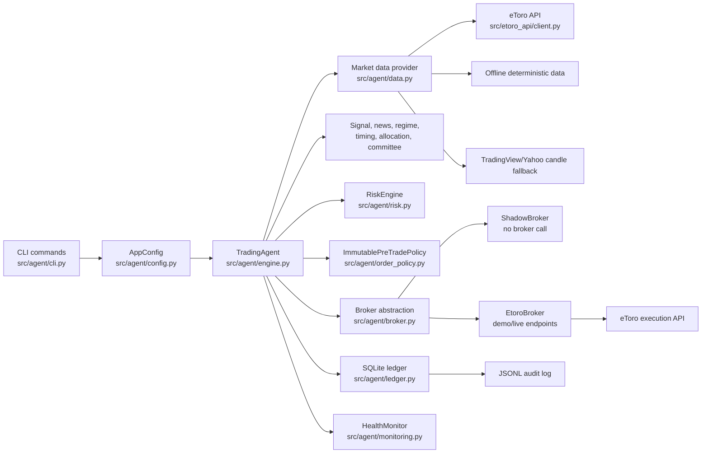
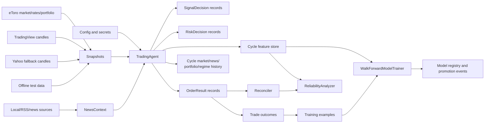
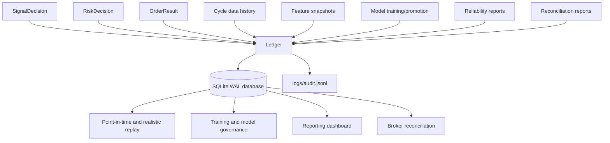

# Taurus Architecture

## Purpose

This document explains the current Taurus architecture as implemented in the local Python agent and how it is intended to evolve into the hosted AI trading governance platform described in the roadmap.

Taurus is built around one architectural rule:

AI and statistical components may propose, score, rank, and explain. Deterministic governance controls decide whether a broker-facing action is allowed.

## Built Now

The current repository contains a local, CLI-first governance engine with:

- configuration loading from `config/strategy.toml` through `src/agent/config.py`,
- decision orchestration in `src/agent/engine.py`,
- market data providers in `src/agent/data.py`,
- eToro REST integration in `src/etoro_api/client.py`,
- chart, news, regime, machine-learning, allocation, committee, timing, and exit signals,
- deterministic risk gates in `src/agent/risk.py`,
- immutable final pre-trade policy in `src/agent/order_policy.py`,
- execution simulation in `src/agent/execution.py`,
- broker abstraction in `src/agent/broker.py`,
- SQLite ledger and JSONL audit log in `src/agent/ledger.py`,
- backtesting and walk-forward validation in `src/agent/backtest.py`,
- model training in `src/agent/training.py`,
- broker reconciliation in `src/agent/reconcile.py`,
- reliability reports in `src/agent/reliability.py`,
- health monitoring and kill-switch escalation in `src/agent/monitoring.py`.

The local product can run in `shadow`, `demo`, or guarded `live` mode. Shadow mode is the default and records decisions without submitting orders to eToro.

## Planned Next

The roadmap extends the local engine into a hosted SaaS platform with:

- read-only web dashboard,
- authentication, sessions, users, workspaces, and RBAC,
- hosted staging and public beta,
- workspace-scoped paper broker,
- backtest, walk-forward, model registry, reliability, reconciliation, and audit UI,
- API v1 and Python SDK,
- audit export packs with redaction, manifests, and checksums,
- tenant isolation, billing interest, product analytics, incidents, status page, privacy workflows, and compliance packs.

## System Context



## Decision Cycle

`TradingAgent.run_once()` is the main production-like cycle. It performs safety checks first, then builds an evidence bundle before any broker-facing action is attempted.

```mermaid
flowchart TD
    Start[Start cycle] --> Kill{Kill switch active?}
    Kill -- yes --> Halt[Record halted cycle<br/>halt_reason=kill_switch_active]
    Kill -- no --> BuildBroker[build_broker()]
    BuildBroker --> BrokerOK{Broker allowed?}
    BrokerOK -- no --> HaltBroker[Record halted cycle<br/>permission/config error]
    BrokerOK -- yes --> Snapshots[Load market snapshots]
    Snapshots --> News[Load and score news context]
    News --> Regime[Classify market regime]
    Regime --> Rank[Rank signal decisions]
    Rank --> Portfolio[Load portfolio state]
    Portfolio --> History[Record cycle market/news/<br/>portfolio/regime history]
    History --> PortfolioRisk[Evaluate portfolio risk report]
    PortfolioRisk --> Exits[Review open positions<br/>and exit decisions]
    Exits --> Allocation[Build allocation plan]
    Allocation --> Sim[Attach execution simulations]
    Sim --> VetoMemory[Attach veto-memory features]
    VetoMemory --> Committee[Committee approval features]
    Committee --> Loop[For each trade decision]
    Loop --> RecordDecision[Record decision]
    RecordDecision --> RiskGate[RiskEngine.evaluate()]
    RiskGate --> RecordRisk[Record risk check]
    RecordRisk --> Approved{Risk approved?}
    Approved -- no --> Next[Next decision]
    Approved -- yes --> Order[Create OrderRequest]
    Order --> Policy[ImmutablePreTradePolicy.evaluate()]
    Policy --> PolicyOK{Policy approved?}
    PolicyOK -- no --> RecordRejected[Record rejected order]
    PolicyOK -- yes --> Execute[Broker.execute()]
    Execute --> RecordOrder[Record order result]
    RecordOrder --> Actuals[Record execution actuals]
    Actuals --> TradeContext[Record open/closed trade context]
    TradeContext --> Next
    Next --> Done{More decisions?}
    Done -- yes --> Loop
    Done -- no --> Features[Record feature snapshots<br/>and cycle features]
    Features --> Monitor[Record cycle health]
    Monitor --> Result[Return AgentCycleResult]
```

## Data Flow

The system creates an auditable chain from raw inputs to decision evidence, risk checks, order attempts, and later model/reliability learning.



## Ledger And Audit Trail

`src/agent/ledger.py` is the audit backbone. It initializes SQLite in WAL mode with foreign keys enabled and also appends JSONL audit events for key governance records.

Core persisted records include:

- decisions,
- risk checks,
- orders,
- loss events,
- trade outcomes,
- broker account snapshots,
- reconciliations,
- model calibrations,
- cycle health,
- position reviews,
- open trade contexts,
- feature snapshots and normalized feature values,
- cycle feature store,
- cycle market snapshots, candle history, news items, portfolio snapshots, and regime history,
- training examples,
- model training runs, model registry, and promotion events,
- reliability reports,
- trade root causes and decision veto memory,
- portfolio risk reports,
- committee votes,
- execution simulations and actuals,
- news source statistics, outcomes, and credibility profiles.



## Main Modules

### `src/agent/engine.py`

`TradingAgent` is the orchestration layer. It wires configuration, data, news, signal ranking, risk, portfolio analysis, allocation, exits, pre-trade policy, execution simulation, committee checks, broker execution, ledger writes, and monitoring into a single cycle.

It is deliberately not only a prediction loop. It records every major decision point and returns an `AgentCycleResult` containing decisions, position reviews, risk decisions, orders, dashboard summary, halted state, and halt reason.

### `src/agent/risk.py`

`RiskEngine` owns deterministic trade approval. It rejects non-actionable signals, blocked asset types, stale data, wide spreads, closed exchanges, disabled buys, excessive leverage, daily loss breaches, rolling drawdown breaches, max-position breaches, cooldown after loss, duplicate same-cycle orders, liquidity issues, slippage issues, weak execution quality, sector/peer/correlation crowding, gross exposure breaches, portfolio optimization breaches, and kill-switch activation.

It also calculates adaptive stop-loss and take-profit rates for approved buy decisions.

### `src/agent/ledger.py`

`Ledger` creates and writes the local SQLite governance database and JSONL audit log. It is both the evidence store for current operations and the training/reliability data source for later analysis.

The ledger is intentionally broader than an order journal. It stores the context needed to explain, replay, train, reconcile, and review the system.

### `src/agent/broker.py`

`Broker` is a protocol with `ShadowBroker` and `EtoroBroker` implementations. `build_broker()` selects the broker from execution mode and safety settings.

Shadow mode returns accepted synthetic order IDs without calling eToro. Demo and live modes require credentials. Live mode additionally requires both `AUTOTRADER_ALLOW_LIVE=true` and the `--allow-live` CLI flag.

### `src/agent/training.py`

`WalkForwardModelTrainer` trains a pure-Python logistic regression meta-label filter from ledger rows. It uses time splits, threshold selection, holdout evaluation, walk-forward windows, artifact writing, model registry insertion, and promotion/rejection gates against the active model.

### `src/agent/reconcile.py`

`Reconciler` compares eToro portfolio state with local ledger orders and open trade contexts. It detects duplicate exposure, missing local orders, missing broker positions, position-level drift, stale protection, and broker/ledger P&L mismatch. It records the reconciliation report in the ledger.

### `src/agent/reliability.py`

`ReliabilityAnalyzer` produces feature ablation, calibration, paper scorecard, labeled dataset, and governance dashboard reports. It uses ledger outcomes, feature rows, orders, execution slippage profiles, and news credibility profiles to surface model, feature, source, execution, and decision drift.

### `src/etoro_api/client.py`

`EtoroClient` is a small standard-library REST client. It handles request headers, request IDs, query encoding, JSON parsing, 429 retry delay, network retries, instrument search, rates, candles, portfolio state, P&L, open market orders by amount, close-position calls, and trade history.

## Current Boundaries

Built now:

- local CLI agent,
- local SQLite and JSONL evidence,
- eToro API client,
- shadow/demo/live mode abstraction,
- deterministic risk and pre-trade policy,
- backtesting and walk-forward validation,
- model training and promotion gates,
- reliability reports,
- broker reconciliation,
- kill switch.

Not built yet:

- hosted web app,
- user authentication,
- workspaces and tenant isolation,
- hosted paper broker,
- API keys and SDK,
- audit export packs,
- incident/status/support UX,
- billing and entitlements,
- GDPR/CCPA workflows,
- public beta onboarding.

## Architectural Leadership Position

Taurus is intentionally structured as governance infrastructure, not a trading script. The main technical contribution is the layering of:

- signal generation,
- deterministic risk approval,
- immutable pre-trade checks,
- broker capability boundaries,
- ledger-first evidence,
- model lifecycle controls,
- reconciliation,
- reliability reporting,
- emergency halt controls.

That layered architecture is the foundation for turning the current local agent into a credible fintech SaaS platform.
