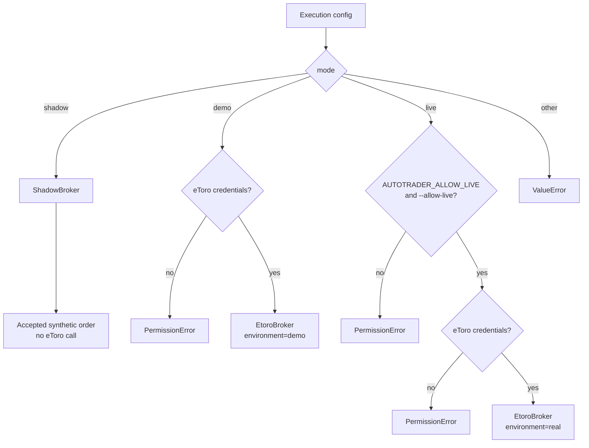
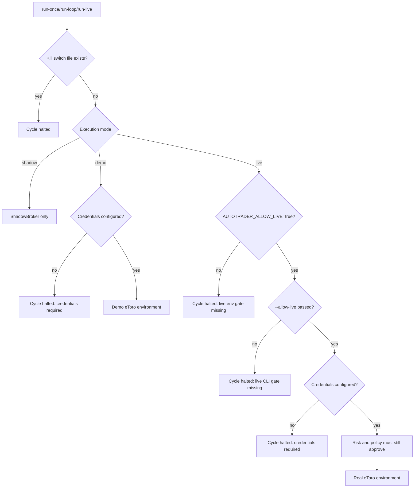
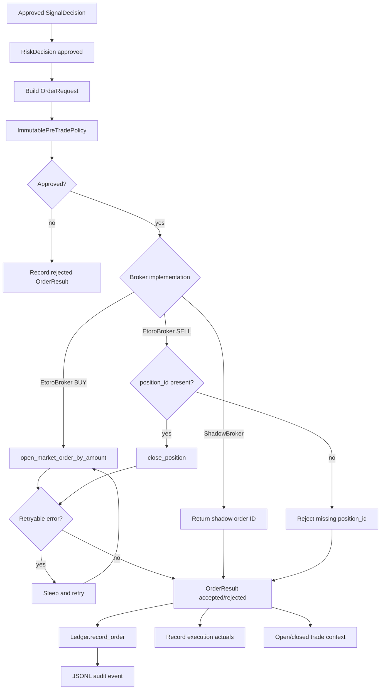
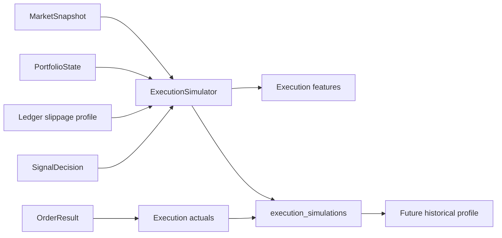
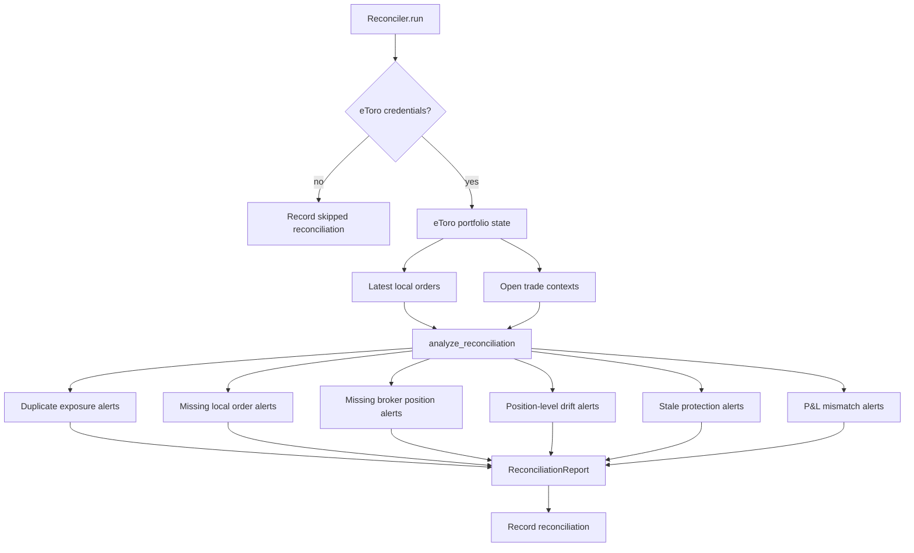

# Taurus Broker And Execution Architecture

## Purpose

This document explains how Taurus separates research decisions from broker-facing execution. It covers shadow, demo, and guarded live execution, eToro integration, order policy, reconciliation, ledger evidence, and safety gates.

The core principle is:

No broker-facing action should occur unless configuration, mode, credentials, live gates, risk controls, pre-trade policy, and kill-switch state all allow it.

## Built Now

Current broker and execution behavior is implemented through:

- `src/agent/broker.py`: broker protocol, shadow broker, eToro broker, mode selection, live gate,
- `src/etoro_api/client.py`: eToro REST client,
- `src/agent/engine.py`: order request creation, broker execution, execution actuals, trade context updates,
- `src/agent/risk.py`: deterministic risk approvals,
- `src/agent/order_policy.py`: final pre-trade policy,
- `src/agent/execution.py`: expected slippage, fill probability, liquidity, and execution quality simulation,
- `src/agent/reconcile.py`: broker versus ledger reconciliation,
- `src/agent/broker_sync.py`: broker account and trade-history import for research and reporting,
- `src/agent/ledger.py`: order, execution, account, reconciliation, and audit persistence.

## Planned Next

The roadmap extends this into:

- hosted paper broker,
- broker adapter registry,
- broker capability discovery,
- workspace-scoped paper accounts and orders,
- API endpoints for broker and paper portfolio data,
- audit exports with redaction and checksums,
- beta-safe execution controls with no public live execution.

## Execution Modes

| Mode | Current behavior | Broker call? | Safety posture |
| --- | --- | --- | --- |
| `shadow` | Records synthetic accepted order results with `shadow-*` IDs. | No | Default local mode. Safe for research and demos. |
| `demo` | Uses eToro demo execution endpoints if credentials are present. | Yes, demo | Requires eToro credentials. |
| `live` | Uses eToro real execution endpoints only when both live gates are enabled. | Yes, real | Requires credentials, `AUTOTRADER_ALLOW_LIVE=true`, `--allow-live`, and no kill switch. |

Hosted beta scope remains paper/research/governance-first and should not expose public live execution.

## Broker Selection

`build_broker()` centralizes mode selection.



## Demo And Live Safety Gates

Taurus currently enforces several safety layers before live execution can occur.



Important distinction: live mode can be configured in TOML, but the code still refuses live broker construction unless both the environment variable and CLI flag are present.

## Broker Execution Flow



## eToro API Boundary

`EtoroClient` uses only the Python standard library. It adds:

- `x-request-id`,
- `x-api-key`,
- `x-user-key`,
- `Accept: application/json`,
- configured user agent,
- JSON request body encoding,
- query parameter encoding,
- retry behavior for HTTP 429,
- retry behavior for network errors,
- parsed `EtoroApiError` with HTTP status and payload.

Current eToro methods include:

- identity and agent portfolio lookup,
- instrument search,
- market rates,
- candles,
- raw portfolio and P&L,
- parsed portfolio state,
- market open orders by amount,
- close position,
- trade history.

## Order Payloads

For BUY orders, `EtoroBroker.execute()` calls:

```text
EtoroClient.open_market_order_by_amount(
    environment=demo|real,
    instrument_id=...,
    is_buy=True,
    amount_usd=...,
    leverage=...,
    stop_loss_rate=...,
    take_profit_rate=...,
    trailing_stop=...
)
```

For SELL orders, it requires `position_id` and calls:

```text
EtoroClient.close_position(
    environment=demo|real,
    position_id=...,
    units_to_deduct=None
)
```

The broker attempts to extract a broker order ID from common response fields such as `token`, `orderId`, `orderID`, `id`, and nested `orderForOpen` fields.

## Execution Simulation

Before broker execution, Taurus simulates execution quality through `ExecutionSimulator`.

It estimates:

- liquidity score,
- volatility in basis points,
- spread cost,
- size impact,
- timing penalty,
- historical slippage,
- historical fill rate,
- expected slippage,
- fill probability,
- quality score,
- expected fill price.

The simulation is recorded in `execution_simulations`, then actual fill data is written back when available through `record_execution_actual()`.



## Reconciliation

`Reconciler` compares broker state with local ledger state.



Alert categories currently include:

- `duplicate_exposure`,
- `missing_local_order`,
- `missing_broker_position`,
- `position_level_drift`,
- `stale_protection`,
- `broker_ledger_pnl_mismatch`.

Critical alerts set the report status to `alert`; warnings set it to `warning`; otherwise the report is `ok`.

## Ledger And Audit Evidence

Broker and execution evidence is persisted in:

- `orders`,
- `execution_simulations`,
- `open_trade_contexts`,
- `trade_outcomes`,
- `broker_account_snapshots`,
- `reconciliations`,
- `cycle_health`,
- `audit.jsonl`.

This makes execution behavior reviewable even when no broker order is submitted.

## Built Now Versus Planned Next

Built now:

- shadow broker,
- eToro broker,
- demo/live environment mapping,
- dual live gate,
- eToro credentials gate,
- retry behavior for broker order errors,
- pre-trade policy,
- execution simulation,
- order and audit ledger,
- broker reconciliation.

Planned next:

- hosted paper broker,
- broker adapter registry,
- capability discovery,
- API access to broker capabilities and paper portfolios,
- workspace-scoped orders and accounts,
- audit export packs,
- hosted beta execution restrictions,
- incident workflow for broker/reconciliation failures.

## Compliance Position

Broker integration exists to support controlled research, demo execution, reconciliation, and governance evidence. Taurus must not be marketed as a public live trading service, copy-trading service, managed account, or investment-advice system. Public beta should remain paper/research-first.
