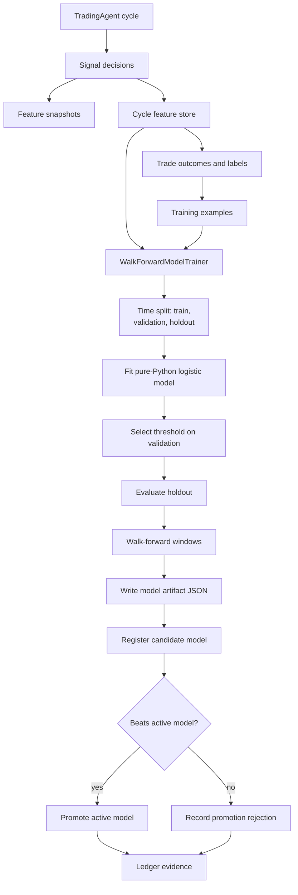
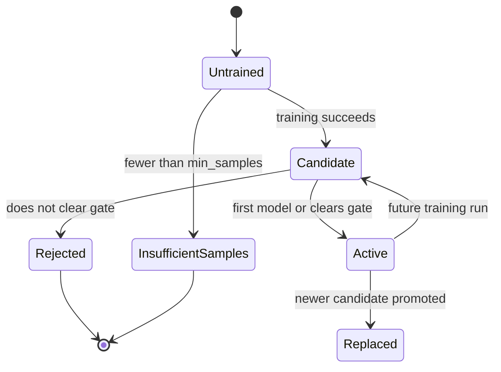
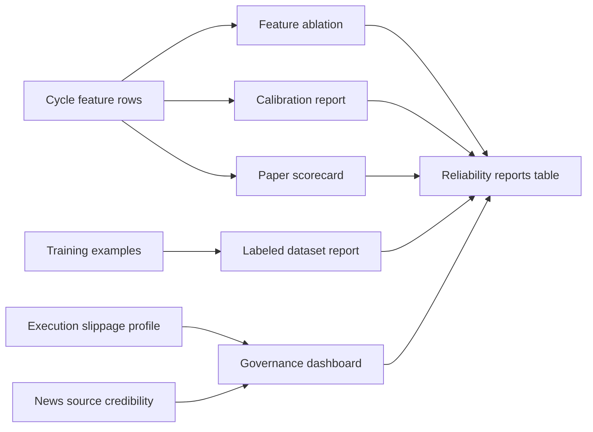
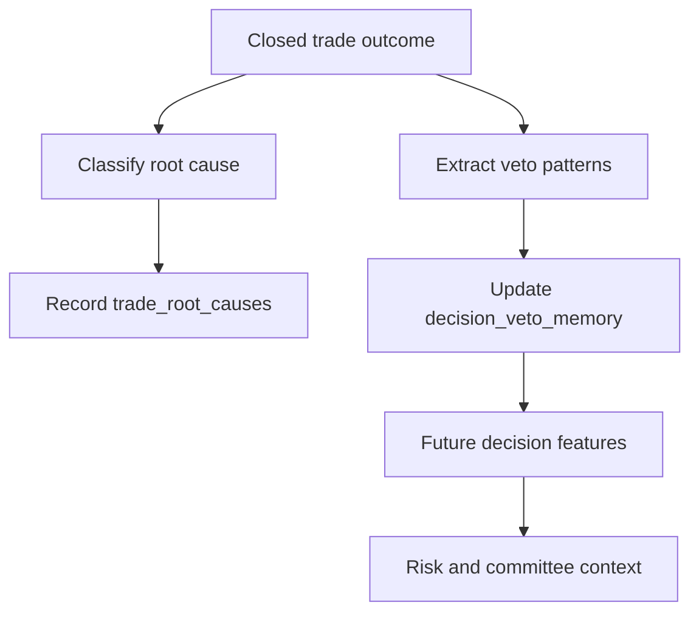

# Taurus Model Governance

## Purpose

This document explains how Taurus handles model training, model promotion, reliability reporting, feature evidence, and replay. The goal is to show that Taurus treats AI and statistical models as governed components, not unquestioned authorities.

The core principle is:

Models can influence decisions, but model outputs must be recorded, tested, calibrated, promoted, rejected, monitored, and replayed.

## Built Now

Current model governance is implemented through:

- `src/agent/engine.py`: feature capture during decision cycles,
- `src/agent/ledger.py`: feature store, training examples, model registry, promotion events, reliability reports, root causes, veto memory,
- `src/agent/training.py`: walk-forward model training and promotion gate,
- `src/agent/reliability.py`: feature ablation, calibration, paper scorecard, labeled dataset, and governance dashboard reports,
- `src/agent/calibration.py`: threshold calibration from outcomes or backtests,
- `src/agent/ml.py`: outcome memory used during signal ranking,
- `src/agent/point_in_time.py`: replay and realistic replay from saved evidence,
- `src/agent/backtest.py`: backtesting and walk-forward validation.

## Planned Next

The roadmap extends model governance into:

- web model registry,
- candidate/active/rejected/archived states in the UI,
- promote and rollback flows,
- drift dashboard,
- model review required flags,
- API endpoints for model versions and reliability reports,
- audit exports and compliance packs,
- enterprise admin controls.

## Model Evidence Flow

## Feature Capture

The engine records features at several points in the decision cycle:

- raw signal score and confidence,
- chart and momentum features,
- news sentiment and catalyst features,
- market regime probabilities and stress,
- allocation and portfolio overlay features,
- timing features,
- execution simulation features,
- veto memory features,
- committee consensus features,
- risk approval and risk details,
- outcome labels and returns once outcomes exist.

`Ledger.record_feature_snapshot()` stores raw feature payloads and normalized numeric feature values. `Ledger.record_cycle_features()` writes a structured row into `cycle_feature_store`, which later supports training, replay, reporting, and reliability analysis.

## Training Lifecycle

`WalkForwardModelTrainer` trains a model named `supervised_meta_label_filter`.

The lifecycle is:

1. Read rows from `cycle_feature_store`.
2. Fall back to `training_examples` if cycle feature rows are unavailable.
3. Sort rows by `created_at`.
4. Select available numeric features, prioritizing `DEFAULT_FEATURES`.
5. Split by time into train, validation, and holdout sets.
6. Fit a pure-Python logistic regression model.
7. Select a threshold using validation data.
8. Evaluate validation and holdout metrics.
9. Run walk-forward windows over the full dataset.
10. Fit a final model on all available rows.
11. Generate a deterministic model version hash.
12. Write a JSON artifact under the ledger model artifact directory.
13. Record the training run.
14. Register the model version as `candidate`.
15. Promote it if it clears the promotion gate, otherwise record a rejection event.

## Promotion Gate

A candidate is promoted only when it improves enough against the active model. The gate compares:

- holdout profit capture,
- holdout precision,
- walk-forward average profit capture,
- holdout accuracy,
- calibration through Brier score tolerance,
- max loss capture tolerance.

If no active model exists, the first trained model is promoted. If an active model exists and the candidate does not clear the gate, Taurus records `candidate_did_not_clear_promotion_gate`.

This is important because model promotion is treated as a governed event, not an automatic side effect of training.

## Reliability Reports

`ReliabilityAnalyzer` creates model and system reliability evidence from ledger data.

Current report types:

- `feature_ablation`: ranks numeric features by profit lift and false-positive rate, with grouped ablation for news, regime, execution, committee, timing, and portfolio.
- `calibration`: compares predicted confidence-like fields against realized win rates and expected calibration error.
- `paper_scorecard`: summarizes trade count, win rate, drawdown, order rejection rate, and recent reconciliation reports.
- `labeled_dataset`: checks outcome sample count and feature completeness.
- `governance_dashboard`: reviews feature drift, execution drift, noisy news sources, and review status.

## Drift And Review

The current governance dashboard computes a simple feature drift report by comparing prior and recent halves of the training rows and measuring z-drift for numeric features. It also checks execution drift through slippage prediction error and highlights noisy news sources.

Current behavior:

- status is `insufficient_data` when there are fewer than 20 feature rows,
- status is `review` when max feature drift is high or average execution prediction error is high,
- otherwise status is `ok`.

Planned behavior:

- dedicated drift dashboard,
- API endpoint,
- model review required flag,
- incident or admin review workflow when drift exceeds thresholds.

## Root Causes And Veto Memory

When closed trade outcomes are recorded, Taurus can classify root causes and update decision veto memory.

Current root cause categories include:

- bad entry,
- news failure,
- regime shift,
- execution slippage,
- portfolio beta,
- winner.

`veto_patterns_from_features()` extracts recurring loss patterns such as negative news, high expected slippage, high portfolio stress, low timing confidence, and market regime labels. The ledger can later attach veto-memory features to new decisions before risk evaluation.

## Replay And Auditability

Model governance depends on being able to reconstruct what the system knew at the time.

The ledger stores:

- market snapshots,
- candle history,
- news items,
- portfolio snapshots,
- regime history,
- feature rows,
- decisions,
- risk checks,
- orders,
- model training runs,
- model versions,
- reliability reports.

This supports point-in-time replay and realistic replay commands in the CLI. In the hosted roadmap, the same evidence base becomes audit exports and compliance packs.

## Built Now Versus Planned Next

Built now:

- feature snapshots,
- cycle feature store,
- training examples from outcomes,
- pure-Python model training,
- time split and walk-forward validation,
- model artifact JSON files,
- model registry,
- promotion and rejection events,
- reliability reports,
- root cause classification,
- veto memory,
- replay support.

Planned next:

- model registry UI,
- explicit rollback UI,
- hosted model lineage views,
- drift dashboard,
- model review required flag,
- API access to model governance records,
- audit export and compliance pack support,
- workspace-scoped model governance.

## Compliance Position

Taurus model governance avoids positioning models as investment advisers. The model lifecycle exists to document, constrain, and review AI-assisted trading workflows. It supports paper/research evidence, auditability, and operational accountability rather than public trading recommendations or performance claims.
