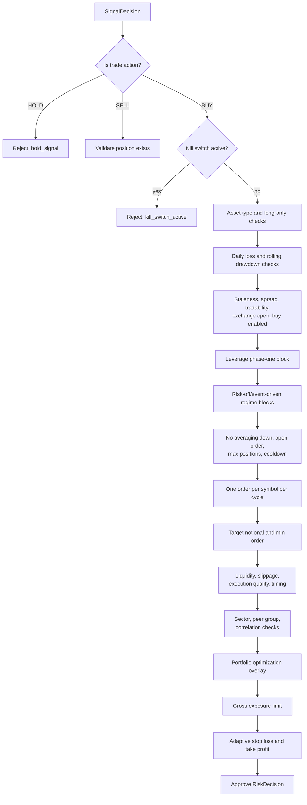
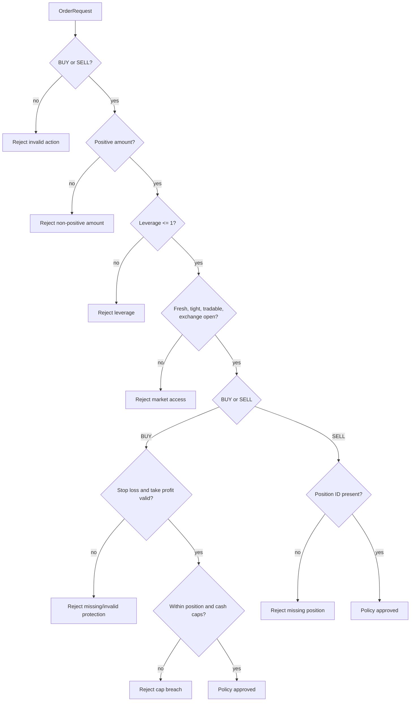

# Taurus Risk Governance

## Purpose

This document explains how Taurus governs trading decisions through deterministic risk controls. It is written for technical reviewers, investors, future users, and compliance-aware stakeholders who need to understand why Taurus is an AI trading governance platform rather than a profit-guarantee bot.

The core principle is:

AI can propose a trade. Taurus risk governance decides whether that proposal is allowed to proceed.

## Built Now

Current risk governance is implemented across:

- `src/agent/engine.py`: cycle orchestration and decision-to-order workflow,
- `src/agent/risk.py`: deterministic risk gates,
- `src/agent/order_policy.py`: final immutable pre-trade policy,
- `src/agent/allocation.py`: capital allocation and planned-exit cash reservation,
- `src/agent/portfolio.py`: portfolio risk, overlays, stress, diversification, and concentration checks,
- `src/agent/execution.py`: execution quality, slippage, fill probability, and liquidity simulation,
- `src/agent/broker.py`: broker mode selection and live execution permission gates,
- `src/agent/ledger.py`: risk, order, feature, portfolio risk, and audit persistence,
- `src/agent/monitoring.py`: cycle health monitoring and kill-switch escalation.

## Planned Next

The roadmap extends risk governance into:

- dashboard risk views,
- workspace-scoped risk records,
- hosted paper broker risk controls,
- audit export packs,
- role-based access control,
- incident management,
- model drift review flags,
- enterprise admin views,
- compliance packs and public beta safety notices.

## Risk Gate Flow



## Deterministic Controls

`RiskEngine.evaluate()` rejects trades for explicit, auditable reasons. Current rejection paths include:

- `kill_switch_active`,
- `hold_signal`,
- `shorting_disabled`,
- `asset_type_not_allowed`,
- `daily_loss_limit`,
- `rolling_drawdown_limit`,
- `stale_market_data`,
- `spread_too_wide`,
- `instrument_not_tradable`,
- `exchange_closed`,
- `buy_disabled`,
- `live_leverage_disabled_for_phase_one`,
- `regime_risk_off_buy_block`,
- `regime_event_driven_buy_block`,
- `averaging_down_disabled`,
- `open_order_exists`,
- `max_positions_reached`,
- `cooldown_after_loss`,
- `one_order_per_symbol_per_cycle`,
- `order_too_small`,
- `liquidity_too_thin`,
- `expected_slippage_too_high`,
- `execution_quality_too_low`,
- `trade_timing_unfavorable`,
- `unstable_market_structure`,
- `sector_exposure_limit`,
- `sector_position_limit`,
- `peer_group_crowding_limit`,
- `symbol_correlation_limit`,
- `average_correlation_limit`,
- portfolio overlay rejection reasons,
- `gross_exposure_limit`.

For exits, risk approval is intentionally simpler: a sell decision is approved only when there is a position to close.

## Layered Safety Model

Risk governance does not rely on a single check.

```mermaid
flowchart LR
    Proposal[AI/statistical proposal] --> Allocation[Capital allocation]
    Allocation --> Committee[Decision committee]
    Committee --> Risk[RiskEngine]
    Risk --> Policy[ImmutablePreTradePolicy]
    Policy --> Broker[Broker mode gate]
    Broker --> Ledger[Ledger and audit log]
    Ledger --> Monitor[Health monitor]
    Monitor --> KillSwitch[Kill switch if critical]
```



The main layers are:

1. Decision scoring and action classification.
2. Allocation approval and notional sizing.
3. Committee approval.
4. Deterministic risk evaluation.
5. Immutable pre-trade policy immediately before broker submission.
6. Broker mode and live execution gates.
7. Ledger and audit persistence.
8. Monitoring and kill-switch escalation.

## Immutable Pre-Trade Policy

`src/agent/order_policy.py` performs final checks just before broker submission. It rejects invalid actions, non-positive order amounts, leverage above 1, stale data, wide spreads, non-tradable instruments, closed exchanges, missing protection, invalid protection prices, position cap breaches, cash cap breaches, and sell orders without a position ID.

This gives Taurus a final market-access style control even after the main risk engine has approved a proposal.



## Kill Switch

The kill switch is a file-based emergency halt at `risk.kill_switch_path`, defaulting to `state/KILL_SWITCH`.

It is checked:

- at the start of `TradingAgent.run_once()`,
- inside `RiskEngine.evaluate()`,
- by broker execution because a halted cycle never reaches broker submission,
- by monitoring when critical operating conditions require automated halt.

The CLI can manage it with:

```bash
python3 -m agent kill-switch on --config config/strategy.toml
python3 -m agent kill-switch status --config config/strategy.toml
python3 -m agent kill-switch off --config config/strategy.toml
```

## Risk Evidence In The Ledger

Each risk decision is written through `Ledger.record_risk()` into the `risk_checks` table and JSONL audit log.

Related risk evidence is also stored in:

- `decisions`,
- `orders`,
- `cycle_health`,
- `position_reviews`,
- `open_trade_contexts`,
- `feature_snapshots`,
- `cycle_feature_store`,
- `portfolio_risk_reports`,
- `committee_votes`,
- `execution_simulations`,
- `reconciliations`,
- `reliability_reports`.

This creates a replayable record of what the system knew, what it proposed, what risk controls decided, and what was attempted.

## Portfolio And Execution Risk

Taurus treats risk as more than a single order size.

Current portfolio risk controls include:

- max positions,
- max position percent of NAV,
- max gross exposure,
- sector exposure and sector position limits,
- peer group crowding limits,
- symbol and average correlation limits,
- portfolio optimization overlay,
- HHI and diversification scoring,
- stress scenario and expected shortfall constraints.

Current execution risk controls include:

- spread limits,
- market data freshness,
- average daily dollar volume,
- expected slippage,
- execution quality score,
- session timing penalties,
- historical slippage profile,
- fill probability,
- actual fill and prediction-error recording.

## Built Now Versus Planned Next

Built now:

- deterministic risk gates,
- adaptive protection prices,
- portfolio overlay checks,
- pre-trade policy,
- shadow/demo/live mode boundaries,
- kill switch,
- risk audit records,
- portfolio risk reports,
- monitoring hooks.

Planned next:

- web risk dashboard,
- workspace-scoped risk history,
- risk export pack,
- hosted paper broker risk enforcement,
- incident workflows for risk breaches,
- enterprise risk settings and review states,
- drift-triggered model review requirements.

## Compliance Position

Taurus risk governance supports the product boundary:

- no public investment advice,
- no copy trading,
- no managed accounts,
- no return guarantees,
- no public live execution for beta users.

The system is designed to show disciplined infrastructure: it explains why an action was blocked or approved and records the evidence needed for later review.
